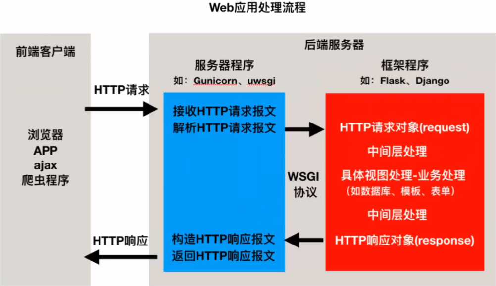
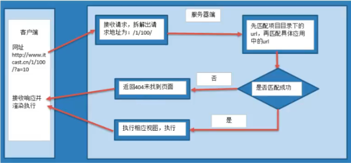

# WEB基础

## 1.1WEB应用程序处理流程

  
请求→响应→处理业务逻辑  

1.客户端（Browser）发送请求报文（request）给服务端（server）  
请求报文→服务器→web程序→解析请求，进行路由分发，执行具体的业务逻辑代码生成响应数据  

- 请求报文
  - 请求行
  - 请求头
  - 请求体

2.服务端（server）发送响应报文（response）给客户端（Browser）

- 响应报文
  - 响应行
  - 响应头
  - 响应体

## 1.2WEB程序框架的意义

- 用于搭建Web应用程序
- 免去不同Web应用相同代码部分的重复编写，只需关心Web应用核心的业务逻辑实现

## 1.3Web应用程序的本质

- 接受并解析HTTP请求，获取具体的请求信息
- 处理本次HTTP请求，即完成本次请求的业务逻辑处理
- 构造并返回处理结果——HTTP响应

## 2.Django流程

## 2.1 Django介绍

Django，发音为``[`dʒæŋɡəʊ]``，是用python语言写的开源web开发框架并遵循MVC设计·劳伦斯出版集团为了开发以新闻内容为主的网站，而开发出来了这个框架，于2005年7月在BSD许可证下发布·这个名称来源于比利时的爵士音乐家DjangoReinhardt，他是一个吉普赛人，主要以义演奏吉它为主，还演奏过小提琴等·由于Django在近年来的迅速发展，应用越来越广泛，被著名IT开发杂志SDTimes评选为2013SDTimes100，位列"API、库和框架"分类第6位，被认为是该领域的佼佼者。  

Django的主要目的是简便、快速的开发数据库驱动的网站。它强调代码复用，多个组件可以很方便的以“插件”形式服务于整个框架，Django有许多功能强大的第三方插件，你甚至可以很方便的开发出自己的工具包。这使得Django具有很强的可扩展性，它还强调快速开发和DRY（DoNotRepeatYourself）原则。

**1）重量级框架**  
对比Flask框架，Django原生提供了众多的功能组件，让开发更简便快速。

- 提供项目工程管理的自动化脚本工具
- 数据库ORM支持（对象关系映射，Object Relational Mapping）
- 模板
- 表单
- Admin管理站点
- 文件管理
- 认证权限
- session机制
- 缓存

**2）MVT模式**  
有一种程序设计模式叫MVC，其核心思想是分工、解耦，让不同的代码块之间降低耦合，增强代码的可扩展性和可移植性，实现向后兼容。

```text
MVC的全拼为Model-View-Controller，最早由TrygveReenskaug在1978年提出，是施乐帕罗奥多研究中心(Xerox PARC)在20世纪80年代为程序语言Smalltalk发明的一种软件设计模式，是为了将传统的输入(input)、处理(processing)、输出(output)任务运用到图形化用户交互模型中而设计的。随着标准输入输出设备的出现，开发人员只需要将精力集中在业务逻辑的分析与实现上。后来被推荐为Oracle旗下Sun公司JavaEE平台的设计模式，并且受到越来越多多的使用ColdFusion和PHP的开发者的欢迎。现在虽然不再使用原来的分工方式，但是这种分工的思想被沿用下来，广泛应用于软件工程中，是一种典型并且应用广泛的软件架构模式。后来，MVC的思想被应用在了Web开发方面，被称为Web MVC框架。
```

**MVC模式说明**  

  

- M全拼为Model，主要封装对数据库层的访问，对数据库中的数效据进行增、删、改、查操作。
- V全拼为View，用于封装结果，生成页面展示的html内容。
- C全拼为Controller，用于接收请求，处理业务逻辑，与Model和View交互，返回结果

**DJango的MVT**
  

- M全拼为Model，与MVC中的M功能相同，负责和数据库交互，进行数据处理。
- V全拼为View，与MVC中的C功能相同，接收请求，进行业务处理，返回应答。
- T全拼为Template，与MVC中的V功能相同，负责封装构造要要返回的html。

## 2.2虚拟环境

原教程使用virtualenv+virtualenvwrapper，现在使用venv。故略

## 2.3创建Django项目

### 步骤

**1）创建**  

- 1.创建Django项目
  - django-admin startproject name
- 2.创建子应用
  - python manager.py startapp name

**2）工程目录说明**  

```bash
 ├── 项目名
 │   ├── asgi.py
 │   ├── __init__.py
 │   ├── settings.py
 │   ├── urls.py
 │   └── wsgi.py
 └── manage.py
```

其中

- `settings.py`是项目的整体配置文件。
- `urls.py`是项目的URL配置文件。
- `wsgi.py`是项目与WSGI兼容的Web服务器入口。
- `asgi.py`是项目与ASGI兼容的异步Web服务器入口，支持异步请求、WebSocket等异步场景。
- `manage.py`是项目管理文件，通过它管理项目。

**3）运行开发服务器**  
在开发阶，为了能够快速预览到开发的效果，django提供了一个纯python编写的轻量级web在开发阶段使用。默认ip是`127.0.0.1`，默认端口为`8000`，完整地址：`http://127.0.0.1:8000/`

```bash
python manage.py runserver ip:端口
python manage.py runserver
```

### 创建子应用

在Web应用中，通常有一些业务功能模块是在不同的项目中都可以复用的，故在开发中通常会将系统拆分为不同的子功能模块，各功能模块间可以保持相对的独立，在其他工程项目中需要用到某个模块时，可以将该模块代码整体复制过去，达到复用。在Flask框架中也有类似子功能应用模块的概念，即蓝图Blueeprint
**Django的视图编写是放在子应用中的。**
**1）创建**  

```bash
python manage.py startapp 子应用名称
```

**2）子应用的目录结构**  

```bash
book/
├── __init__.py       # 空文件，标识这是Python包
├── admin.py          # 配置后台管理（注册模型到admin界面）
├── apps.py           # 子应用配置类（注册时用到，可自定义配置）
├── migrations/       # 模型迁移文件（自动生成，同步模型到数据库）
│   └── __init__.py
├── models.py         # 核心：定义数据模型（对应数据库表结构）
├── tests.py          # 单元测试文件
├── views.py          # 核心：定义视图（处理请求、返回响应）
└── urls.py           # （需手动创建）子应用的URL路由配置（无则无法访问）
```

- `admin.py`文件跟网站的后台管理站点配置相关
- `apps.py`文件用于配置当前子应用的相关信息
- `migrations`目录用于存放数据库迁移历史文件
- `models.py`文件用户保存数据库模型类
- `tests.py`文件用于开发测试用例,编写单元测试
- `views.py`文件用于编写Web应用视图

**3）注册安装子应用**
创建出来的子应用目录文件虽然被放到了工程项目目录中，但是django工程并不能立即直接使用，需要注册安装后才能使用。在工程配置文件`settings.py`中，`INSTALLED_APPS`项保存了工程中已经注册安装的子应用

```python
# 注册/安装子应用
INSTALLED_APPS = [
    'django.contrib.admin',
    'django.contrib.auth',
    'django.contrib.contenttypes',
    'django.contrib.sessions',
    'django.contrib.messages',
    'django.contrib.staticfiles',
    # 'book', # 方案1
    # 'book.apps.BookConfig', # 方案2
]
```

## 2.4模型

分析出项目中所需要的数据，然后设计数据库表。通过ORM转换为特定数据库（mysql、orcale、sqlite）的insert、update、delete语句。转换为特定数据库的select语句，从数据库中返回数据集在转换为python中的列表。  

- ORM里的类对应DB的数据表
- ORM里的对象对应DB的数据行
- ORM里的属性对应DB的字段

### 使用Django进行数据库开发的步骤

- 1.定义模型类
- 2.模型迁移
- 3.操作数据库

**1.定义模型类**  

- 根据书籍表结构设计模型类：
  - 模型类：Booklnfo
  - 书籍名称字段：name
- 根据人物表结构设计模型类：
  - 模型类：Peoplelnfo
  - 人物姓名字段：name
  - 人物性别字段：gender
  - 外键约束：book
    -外键要指定所属的模型类book - models.Foreignkey(Bookinfo)
- 说明：
  - 书籍-人物的关系为一对多，一本书中可以有多个英雄
  - 不需要定义主键字段，在生成表时会自动添加，并且值为自增长
- 根据数据库表的设计
  - 在`models.py`中定义模型类，继承自`models.Model`

```python
from django.db import models
# Create your models here.
class BookInfo(models.Model):
    # 创建字段，字段类型...
    # id已创建
    name = models.CharField(max_length=10)

class PeopleInfo(models.Model):
    name = models.CharField(max_length=10)
    gender = models.BooleanField()
    # 外键约束：人物属于哪本书
    book = models.ForeignKey(BookInfo,on_delete=models.CASCADE)
```

**2.模型迁移**  

- 迁移由两步完成：
  - 生成迁移文件：根据模型类生成创建表的语句

  ```bash
  python manage.py makemigrations
  ```
  
  - 执行迁移：执行表结构文件，这个时候数据库才有表

  ```bash
  python manage.py migrate
  ```

## 2.5站点管理

- **站点**：分为`内容发布`和`公共访问`两部分
- **内容发布**的部分由网站的管理员负责查看、添加、修改、删除数据
- `Django`能够根据定义的模型类自动地生成管理模块
- 使用`Django`的管理模块,需要按照如下步骤操作:
  - 1.管理界面本地化
  - 2.创建管理员
  - 3.注册模型类
  - 4.发布内容到数据库

### 1.管理界面本地化

- 本地化是将显示的语言、时间等使用本地的习惯,这里的本地他化就是进行中国化

- 设置`setting`内容：
  - LANGUAGE_CODE = 'zh-hans' # 'en-us'
  - TIME_ZONE = 'Asia/Chongqing'

### 2.创建管理员

- 创建管理员命令

```bash
python manage.py createsuperuser
```

- 按提示输入用户名、邮箱、密码
- 重置密码

```bash
python manager.py changepassword 用户名
```

- 登陆站点`http://127.0.0.1:8000/admin`(需要服务器启动)

### 3.注册模型类

- 在应用的`admin.py`文件中注册模型类
  - 需要导入模型模块：`from book.models import BookInfo,PeopleInfo`
- 注册模型后可以在站点管理界面快捷方便管理数据

### 4.发布内容到数据库

- 发布内容后，优化模型类展示

```python
# 准备书籍列表信息的模型类
class BookInfo(models.Model):
  # 创建字段，字段类型
  name = models.CharField(max_length=10)

  def __str__(self):
  '''将模型类以字符串的方式输出'''
    return self.name
```

## 2.6视图和URL

- 站点管理页面做好了,接下来就要做`公共访问`的页面了
- 对于`Django`的设计框架`MVT`
  - 用户在URL中请求的是视图
  - 视图接收请求后进行处理
  - 并将处理的结果返回给请求者
- 使用视图时需要进行两步操作
  - 1.定义视图
  - 2.配置URLconf

### 1.定义视图

- 视图就是一个`Python函数`,被定义在应用的`views.py`中
- 视图的第一个参数是`HttpRequest`类型的对象`reqeust` ,包含了所有`请求信息`
- 视图必须返回`HttpResponse`对象,包含返回给请求者的`响应信息`
- 需要寻入`HttpResponse`模块:`from django.http import HttpResponse`
- 定义视图函数:响应字符串`ok!`给客户端

### 2.配置URLconf

- 查找视图的过程：
  - 1.请求者在浏览器地址栏中输入URL,请求到网站
  - 2.网站获取URL信息
  - 3.然后与编写好的URLconf逐条匹配
  - 4.如果匹配成功则调用对应的视图
  - 5.如果所有的URLconf都没有匹配成功.则返回404错误

- `URLconf`入口  
`bookmanager/setting.py/ROOT_URLCONF='bookmanager.urls'`
- 需要两步完成`URLconf`配置
  - 1.在`项目`中定义`URLconf`
  - 2.在`应用`中定义`URLconf`
- 在`项目`中定义`URLconf`

```python
# bookmanager/urls.py
from django.urls import path, include

urlpatterns = [
  path('admin/', admin.site.urls),
  path('', include('book.urls'))
]
```

- 在`应用`中定义`URLconf`
  - 提示：一条`URLconf`包括URL规则、视图两部分
    - URL规则使用正则表达式定义
    - 视图就是在`views.py`中定义的视图函数

    ```python
    # bookmanager/urls.py
    urlpatterns = [
      # path(路由, 视图函数)
      path('index/', index)
    ]
    ```

### 3.测试：访问请求

- `http://127.0.0.1:8000/index/`

### 4.总结

视图处理过程如下图

使用视图时需要进行两步操作，不分先后

- 1.配置`URLconf`
- 2.在`应用/views.py`中定义视图

## 2.7模板

- 思考：网站如何向客户端返回一个漂亮的页面呢?
- 提示：
  - 漂亮的页面需要`html`、`CSS`、`js`
  - 可以把这一堆字段串全都写到视图中，作为`HttpResponse()`的参数，响应给客户端
- 问题:
  - 视图部分代码臃肿，耦合度高
  - 这样定义的字符串是不会出任何效果和错误的
  - 效果无法及时查看.有错也不容易及时发现
- 设想:
  - 是否可以有一个专门定义前端页面的地方，效果可以及时展示错误可以及时发现，并且可以降低模块
间耦合度！
- 解决问题:模板
  - `MVT`设计模式中的`T`，`Template`
- 在`Django`中，将前端的内容定义在模板中，然后再把模板交给视见图调用，各种漂亮、炫酷的效果就出现
了.

### 1.创建模板

- 在`应用`同级目录下创建模板文件夹`templates`，文件夹名称固定写法
- 在`templates`文件夹下,创建`应用`同名文件夹，例：`Book`
- 在应用同名文件夹下创建网页模板文件，例：`index.html`

```html
<!-- BookManager/templates/Book/index.html -->
<!DOCTYPE html>
<html lang="en">
<head>
  <meta charset="UTF-8">
  <title>测试模板数据</title>
</head>
<body>
</body>
</html>
```

### 2.设置模板查找路径

```python
# BookManager/settings.py
TEMPLATES=[
  {
    # ...
    'DIRS':[os.path.join(BASE_DIR, 'templates')],
    # ...
  }
]
```

### 3.模板接收视图传入的数据

- 视图模板加载

```python
# BookManager/templates/Book/index.html存在
def index(request):
  # 准备上下文：定义在字典中的[测试数据]
  context={'title':'测试模板处理数据'}


  # 将上下文交给模板中进行处理，处理后视图响应给客户端
  # render(request, template_name, context=None)
  return render(request, 'Book/index.html', context=context)
```

### 4.模板处理数据

```html
Heme Douy
<!DOCTYPE html>
<html lang="en">
<head>
  <meta charset="UTF-8">
  <title>测试模板数据</title>
</head>
<body>
<h1>根路径下的数据</h1>
{#我是注释#}
{#{{ context的key }}:表示取值 #}
<di style="background: red; font-size: 30px">{{ title }}</di>
<!--通过title,取字典的值-->
</body>
</html>
```

## 2.8配置文件和静态文件

## 2.8.1配置文件

### 1.BASE_DIR

```python
BASE_DIR = os.path.dirname(os.path.dirname(os.path.abspath(__file__))
```

当前工程的根目录，Django会依此来定位工程内的相关文件，也可以使用该参数来构造文件路径

### 2.DEBUG

调试模式，创建工程后初始值为True，即默认工作在调试模式下  
作用：

- 修改代码文件，程序自动重启
- Django程序出现异常时，向前端显示详细的错误追踪信息
部署在线上运行的Django要求：

```python
# BookManager/settings.py
DEBUG=FALSE
ALLOWER_HOSTS = ['*'] # 以任何方式登录
```

### 3.本地语言与时区

Django支持本地化处理，即显示语言与失去支持本地化  
初始化的工程默认语言和时区为英语和UTC标准时区

```python
LANGUAGE_CODE = 'en-us' # 语言
TIME_ZONE = 'UTC' # 时区
```

将语言和时区修改为中国大陆信息

```python
LANGUAGE_CODE = 'zh-hans'
TIME_ZONE = 'Asia/Shanghai'
```

### 2.8.2静态文件

项目中的CSS、图片、js都是静态文件，一般会将静态文件放到一个单独的目录中，以方便管理。在html页面中调用时，也需要指定静态文件的路，Django中提供了一种解所的方式配置静态文件路径，静态文件可以放在项目根目录下，也可以放在应用的目录下，由于有些静态文件在项目中是通用的，所以推荐放在项目的根目录下，方便管理。  
为了提供静态文件，需要配置两个参数：

- **STATICFILES_DIRS**存放查找静态文件的目录
- **STATIC_URL**访问静态文件的URL前缀  

#### 示例

1）在项目根目录下创建`static`目录来保存静态文件。  
2）在`bookmanager/settings.py`中修改静态文件的两个参数为  

```python
# 网页中继目录
STATIC_URL = '/static/'

# 告诉系统图片在哪里
STATICFILES_DIRS = [
  os.path.join(BASE_DIR, 'static'),
]
```

3）此时在static添加的任何静态文件都可以使用网址 **/static/文件在static中的路径** 来访问了。  
例如，向static目录中添加一个index.html文件，在浏览器中就可以使用`127.0.0.1:8000/static/index.html`来访问。  
或者我们在static目录中添加了一个子目录和文件book/detail.html,在浏览器中就可以使用

### 2.8.3App应用配置

在每个应用目录中都包含了apps.py文件，用于保存该应用的相关信息。  
在创建应用时，Django会向apps.py文件中写入一个该应用的配置类，如

```python
from django.apps import AppConfig

class BookConfig(AppConfig):
  name = 'book'
  verbose_name = '图书管理'
```

我们将此类添加到工程settings.py中的INSTALLED_APPS列表中，表名该应用已被注册并纳入Django工程的管理范围

- AppConfig.name属性表示这个配置类时加载到哪个应用的。每个配置必须包含唯一指定name，不可省略或重复
- AppConfig.verbose_name属性用于设置该应用的直观可读的名字，此名字在Django的管理后台、自动化文档等可视化场景中显示，替代纯英文的应用名

## 3.模型

### 3.1重点

- **1.模型配置**
- **2.数据的增删改**
  - 增：`book = Bookinfo() book.save()`和`Bookinfo.objects.create()`
  - 删：`book.delete()`和`BookInfo.objects.get().delete()`
  - 改：`book.name='xxx'、book.save()`和`BookInfo.objects.get().upedate(name=xxxx)`
- **3.数据的查询**
  - 基础查询
  - F对象和Q对象

### 3.2项目准备

<details>

<summary>
点击查看详细内容
</summary>

#### 1.创建项目

```bash
django-admin startproject bookmanager
```

#### 2.创建应用

```bash
python manage.py startapp book
```

#### 3.更换python解释器

```bash
# 进入指定虚拟环境
which python
```

#### 4.安装应用

```python
INSTALLED_APPS = [
    'django.contrib.admin',
    'django.contrib.auth',
    'django.contrib.contenttypes',
    'django.contrib.sessions',
    'django.contrib.messages',
    'django.contrib.staticfiles',

    # 添加子应用
    'book.apps.BookConfig',
]
```

#### 5.定义数据模型

在子应用book的models.py中定义数据模型，用于映射数据库表

```python
class BookInfo(models.Model):
    # 创建字段，字段类型...
    # id已创建
    name = models.CharField(max_length=10)

    def __str__(self):
        return self.name

class PeopleInfo(models.Model):
    name = models.CharField(max_length=10)
    gender = models.BooleanField()
    # 外键约束：人物属于哪本书
    book = models.ForeignKey(BookInfo,on_delete=models.CASCADE)
```

#### 6.模型迁移

将定义的模型转换为数据库表

- 1.生成迁移文件，执行后会在`book/migrations`目录下生成迁移文件

```bash
python manage.py makemigrations
```

- 2.执行迁移（创建数据库表）

```bash
python manage.py migrate
```

#### 7.配置后台管理

在后台管理界面中管理数据，需要注册模型

- 1.在`book/admin.py`中注册模型

```python
from django.contrib import admin
from book.models import BookInfo, PeopleInfo

# 注册模型类
admin.site.register(BookInfo)
admin.site.register(PeopleInfo)
```

- 2.创建超级管理员

```bash
python manage.py createsuperuser
```

按照提示输入用户名、邮箱、密码

- 3.启动开发服务器，访问后台

```bash
python manage.py runserver 8000 # 8000为服务器端口号
```

打开浏览器访问`http://127.0.0.1:8000/admin`，使用超级管理员账号登录，即可看到注册的书籍信息模型，可在其中添加/编辑/删除书籍数据。

#### 8.定义视图

在`./book/views.py`中定义视图函数，处理用户请求
在`./templates/Book/index.html`存在

```python
from django.shortcuts import render
from django.http import HttpRequest
from django.http import HttpResponse

# 我们期望用输入http://127.0.0.1:8000/index/访问视图函数
def index(request):
  # 准备上下文：定义在字典中的[测试数据]
  context={'title':'测试模板处理数据'}
  # 将上下文交给模板中进行处理，处理后视图响应给客户端
  # render(request, template_name, context=None)
  return render(request, 'Book/index.html', context=context)
```

#### 9.配置URL路由

需要配置项目级和应用级两级URL

- 1.应用级URL（`book/urls.py`手动创建）

```python
# book/urls.py
from django.urls import path
from book.views import index

urlpatterns = [
    path('index/', index)
]
```

- 2.项目级URL（`bookmanager/urls.py`）

```python
# bookmanager/urls.py
from django.contrib import admin
from django.urls import path, include
from book.views import index

urlpatterns = [
    path('admin/', admin.site.urls),
    # 包含子应用的URL，访问子应用路由时空路径开头可替换任意字符
    path('', include('book.urls')),
]
```

#### 10.创建模板

用于展示页面  

- 1.在项目根目录创建templates文件夹（存放所有模板），并在其中创建与子应用同名的文件夹book（避免模板名冲突）。  
- 2.创建书籍列表模板book_list.html

```html
<!-- templates/book/book_list.html -->
<!DOCTYPE html>
<html lang="zh-CN">
<head>
    <meta charset="UTF-8">
    <title>书籍列表</title>
</head>
<body>
    <h1>书籍列表</h1>
    <ul>
        <!-- 遍历视图传递的books数据 -->
        
            <li>
                {{ book.title }} - 发布日期：{{ book.pub_date }} - 阅读量：{{ book.read_count }}
            </li>
        
            <li>暂无书籍数据</li>  <!-- 当books为空时显示 -->
        
    </ul>
</body>
</html>
```

- 3.配置模板路径  
在bookmanager/settings.py的TEMPLATES中设置DIRS：

```python
# bookmanager/settings.py
import os
TEMPLATES = [
    {
        # ... 其他配置 ...
        'DIRS': [os.path.join(BASE_DIR, 'templates')],  # 添加模板根目录
        # ... 其他配置 ...
    },
]
```

</details>

### 3.3配置

在settings.py中保存了数据库的连接配置信息，Django默认初始配置使用sqlite数据库

```python
DATABASES = {
  'default':{
  'ENGINE': 'django.db.backends.sqlite3',
  'NAME': os.path.join(BASE_DIR, 'db.sqlite3'),
  }
}
```

#### 1.在MySQL中创建数据库

```bash
create database book charset=utf8mb4;
```

#### 2.修改DATABASES配置信息

```python
DATABASES = {
  'default':{
    'ENGINE':'django.db.backends.mysql',
    'HOST':'127.0.0.1', # 数据库主机
    'PORT':3306,        # 数据库端口
    'USER':'root',      # 数据库用户名
    'PASSWORD':'mysql', # 数据库用户密码
    'NAME':'book'       # 数据库名字
  }
}
```

#### 3.运行测试

发现错误

- 虚拟环境中没有安装MySQL数据库的客户端驱动  
- 安装mysqlclient
- **步骤 1**：安装gcc编译器+Python3开发库

```bash
sudo apt install -y gcc python3-dev
```

- **步骤 2**：回到虚拟环境安装 mysqlclient

```bash
pip3 install mysqlclient
```

### 3.4定义模型类

- 模型类被定义在"应用/models.py"文件中  
- 模型类必须继承自Model类,位于包django.db.models中  

接下来首先以"图书-人物"管理为例进行演示


#### 3.4.1定义

在models.py文件中定义模型类

```python
from django.db import models

# 准备书籍列表信息的模型类
class BookInfo(models.Model):
    # 创建字段,字段类型...
    name = models.CharField(max_length=28, verbose_name='名称')
    pub_date = models.DateField(verbose_name='发布日期', null=True)
    readcount = models.IntegerField(default=0, verbose_name='阅读量')
    commentcount = models.IntegerField(default=0, verbose_name='评论量')
    is_delete = models.BooleanField(default=False, verbose_name='逻辑删除')

    # Meta是模型的配置项，专门用来定制模型的非字段相关规则
    class Meta:
        db_table = 'bookinfo'  # 修改表名
        verbose_name = '图书'  # 在admin站点中显示的名称

    def __str__(self):
        '''定义每个数据对象的显示信息'''
        return self.name

# 准备人物列表信息的模型类
class PeopleInfo(models.Model):
    GENDER_CHOICES = (
        (0, 'male'),
        (1, 'female')
    )
    name = models.CharField(max_length=20, verbose_name='名称')  
    gender = models.SmallIntegerField(choices=GENDER_CHOICES, default=0, verbose_name='性别')
    description = models.CharField(max_length=200, null=True, verbose_name='描述信息')
    book = models.ForeignKey(BookInfo, on_delete=models.CASCADE, verbose_name='图书')
    is_delete = models.BooleanField(default=False, verbose_name='逻辑删除')

    class Meta:
        db_table = 'peopleinfo'
        verbose_name = '人物信息'

    def __str__(self):
        return self.name
```

1）数据库表名  

模型类如果未指明表名，Django默认以小写app应用名_小写模型类名为数据库表名  
可通过**db_table**指明数据库表名  

2）关于主键  

django会为表创建自动增长的主键列，每个模型只能有一个主键列，如果果使用选项设置某属性为主键列后，django不会再创建自动增长的主键列  
默认创建的主键列属性为id，可以使用pk代替，pk全拼为`primary key` 

3）属性命名限制  

- 不能是python的保留关键字
- 不允许使用连续的下划线，这是由django的查询方式决定的
- 定义属性时需要指定字段类型，通过字段类型的参数指定选项，语法如下：

```text
属性=models.字段类型(选项)
```

4）字段类型

| 字段类型         | 说明                                                                 |
|------------------|----------------------------------------------------------------------|
| AutoField        | 自动增长的IntegerField，通常不用指定，不指定时Django会自动创建属性名为`id`的自动增长属性 |
| BooleanField     | 布尔字段，值为`True`或`False`                                         |
| NullBooleanField | 支持`Null`、`True`、`False`三种值                                      |
| CharField        | 字符字段，必须指定`max_length`参数表示最大字符个数                     |
| TextField        | 大文本字段，一般用于内容超过4000个字符的场景                           |
| IntegerField     | 整数类型字段，存储普通整数数据                                         |
| DecimalField     | 十进制浮点数字段，需指定`max_digits`（总位数）和`decimal_places`（小数位数）参数 |
| FloatField       | 浮点数字段，用于存储浮点类型数据                                       |
| DateField        | 日期类型字段<br>- `auto_now`：每次保存对象时自动设为当前时间（用于“最后修改时间”），默认为False<br>- `auto_now_add`：对象创建时自动设为当前时间（用于“创建时间”），默认为False<br>- 注意：`auto_now`和`auto_now_add`相互排斥，不可同时使用 |
| TimeField        | 时间类型字段，支持的参数与`DateField`一致                               |
| DateTimeField    | 日期时间类型字段，支持的参数与`DateField`一致                           |
| FileField        | 上传文件字段，用于接收用户上传的文件数据                               |
| ImageField       | 继承自`FileField`，额外增加了“校验上传内容为有效图片”的功能             |

5）选项

| 选项         | 说明                                                                 |
|--------------|----------------------------------------------------------------------|
| null         | 如果为True，表示允许为空，默认值是False                               |
| blank        | 如果为True，则该字段允许为空白，默认值是False                         |
| db_column    | 字段的名称，如果未指定，则使用属性的名称                             |
| db_index     | 若值为True，则在表中会为此字段创建索引，默认值是False                 |
| default      | 默认                                                                 |
| primary_key  | 若为True，则该字段会成为模型的主键字段，默认值是False，一般作为AutoField的选项使用 |
| unique       | 如果为True，这个字段在表中必须有唯一值，默认值是False                 |  

**null是数据库范畴的概念，blank是表单验证范畴的**

6）外键
在设置外键时,需要通过**on_delete**选项指明主表删除数据时，对于外键引用表数据如何处理，在`django.db.models`中包含了可选常量:

- **CASCADE**级联,删除主表数据时连通一起删除外键表中数据
- **PROTECT**保护,通过抛出**ProtectedError**异常,来阻止删除主表中被外键应用的数据
- **SET_NULL**设置为NULL,仅在该字段null=True允许为null时可用用
- **SET_DEFAULT**设置为默认值,仅在该字段设置了默认值时可用
- **SET()** 设置为特定值或者调用特定方法
- **DO_NOTHING**不做任何操作,如果数据库前置指明级联性,此选项会抛出**IntegrityError**异常

## 4.视图
