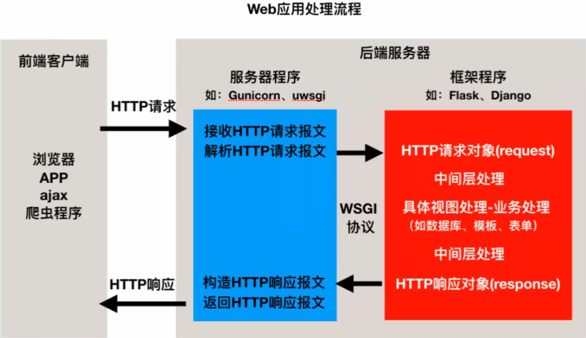
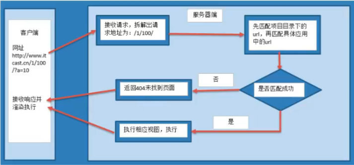

# WEB基础

## 1.1WEB应用程序处理流程

  
请求→响应→处理业务逻辑  

1.客户端（Browser）发送请求报文（request）给服务端（server）  
请求报文→服务器→web程序→解析请求，进行路由分发，执行具体的业务逻辑代码生成响应数据  

- 请求报文
  - 请求行
  - 请求头
  - 请求体

2.服务端（server）发送响应报文（response）给客户端（Browser）

- 响应报文
  - 响应行
  - 响应头
  - 响应体

## 1.2WEB程序框架的意义

- 用于搭建Web应用程序
- 免去不同Web应用相同代码部分的重复编写，只需关心Web应用核心的业务逻辑实现

## 1.3Web应用程序的本质

- 接受并解析HTTP请求，获取具体的请求信息
- 处理本次HTTP请求，即完成本次请求的业务逻辑处理
- 构造并返回处理结果——HTTP响应

## 2.Django流程

## 2.1 Django介绍

Django，发音为``[`dʒæŋɡəʊ]``，是用python语言写的开源web开发框架并遵循MVC设计·劳伦斯出版集团为了开发以新闻内容为主的网站，而开发出来了这个框架，于2005年7月在BSD许可证下发布·这个名称来源于比利时的爵士音乐家DjangoReinhardt，他是一个吉普赛人，主要以义演奏吉它为主，还演奏过小提琴等·由于Django在近年来的迅速发展，应用越来越广泛，被著名IT开发杂志SDTimes评选为2013SDTimes100，位列"API、库和框架"分类第6位，被认为是该领域的佼佼者。  

Django的主要目的是简便、快速的开发数据库驱动的网站。它强调代码复用，多个组件可以很方便的以“插件”形式服务于整个框架，Django有许多功能强大的第三方插件，你甚至可以很方便的开发出自己的工具包。这使得Django具有很强的可扩展性，它还强调快速开发和DRY（DoNotRepeatYourself）原则。

**1）重量级框架**  
对比Flask框架，Django原生提供了众多的功能组件，让开发更简便快速。

- 提供项目工程管理的自动化脚本工具
- 数据库ORM支持（对象关系映射，Object Relational Mapping）
- 模板
- 表单
- Admin管理站点
- 文件管理
- 认证权限
- session机制
- 缓存

**2）MVT模式**  
有一种程序设计模式叫MVC，其核心思想是分工、解耦，让不同的代码块之间降低耦合，增强代码的可扩展性和可移植性，实现向后兼容。

```text
MVC的全拼为Model-View-Controller，最早由TrygveReenskaug在1978年提出，是施乐帕罗奥多研究中心(Xerox PARC)在20世纪80年代为程序语言Smalltalk发明的一种软件设计模式，是为了将传统的输入(input)、处理(processing)、输出(output)任务运用到图形化用户交互模型中而设计的。随着标准输入输出设备的出现，开发人员只需要将精力集中在业务逻辑的分析与实现上。后来被推荐为Oracle旗下Sun公司JavaEE平台的设计模式，并且受到越来越多多的使用ColdFusion和PHP的开发者的欢迎。现在虽然不再使用原来的分工方式，但是这种分工的思想被沿用下来，广泛应用于软件工程中，是一种典型并且应用广泛的软件架构模式。后来，MVC的思想被应用在了Web开发方面，被称为Web MVC框架。
```

**MVC模式说明**  

  

- M全拼为Model，主要封装对数据库层的访问，对数据库中的数效据进行增、删、改、查操作。
- V全拼为View，用于封装结果，生成页面展示的html内容。
- C全拼为Controller，用于接收请求，处理业务逻辑，与Model和View交互，返回结果

**DJango的MVT**
  

- M全拼为Model，与MVC中的M功能相同，负责和数据库交互，进行数据处理。
- V全拼为View，与MVC中的C功能相同，接收请求，进行业务处理，返回应答。
- T全拼为Template，与MVC中的V功能相同，负责封装构造要要返回的html。

## 2.2虚拟环境

原教程使用virtualenv+virtualenvwrapper，现在使用venv。故略

## 2.3创建Django项目

### 步骤

**1）创建**  

- 1.创建Django项目
  - django-admin startproject name
- 2.创建子应用
  - python manager.py startapp name

**2）工程目录说明**  

```bash
 ├── 项目名
 │   ├── asgi.py
 │   ├── __init__.py
 │   ├── settings.py
 │   ├── urls.py
 │   └── wsgi.py
 └── manage.py
```

其中

- `settings.py`是项目的整体配置文件。
- `urls.py`是项目的URL配置文件。
- `wsgi.py`是项目与WSGI兼容的Web服务器入口。
- `asgi.py`是项目与ASGI兼容的异步Web服务器入口，支持异步请求、WebSocket等异步场景。
- `manage.py`是项目管理文件，通过它管理项目。

**3）运行开发服务器**  
在开发阶，为了能够快速预览到开发的效果，django提供了一个纯python编写的轻量级web在开发阶段使用。默认ip是`127.0.0.1`，默认端口为`8000`，完整地址：`http://127.0.0.1:8000/`

```bash
python manage.py runserver ip:端口
python manage.py runserver
```

### 创建子应用

在Web应用中，通常有一些业务功能模块是在不同的项目中都可以复用的，故在开发中通常会将系统拆分为不同的子功能模块，各功能模块间可以保持相对的独立，在其他工程项目中需要用到某个模块时，可以将该模块代码整体复制过去，达到复用。在Flask框架中也有类似子功能应用模块的概念，即蓝图Blueeprint
**Django的视图编写是放在子应用中的。**
**1）创建**  

```bash
python manage.py startapp 子应用名称
```

**2）子应用的目录结构**  

```bash
book/
├── __init__.py       # 空文件，标识这是Python包
├── admin.py          # 配置后台管理（注册模型到admin界面）
├── apps.py           # 子应用配置类（注册时用到，可自定义配置）
├── migrations/       # 模型迁移文件（自动生成，同步模型到数据库）
│   └── __init__.py
├── models.py         # 核心：定义数据模型（对应数据库表结构）
├── tests.py          # 单元测试文件
├── views.py          # 核心：定义视图（处理请求、返回响应）
└── urls.py           # （需手动创建）子应用的URL路由配置（无则无法访问）
```

- `admin.py`文件跟网站的后台管理站点配置相关
- `apps.py`文件用于配置当前子应用的相关信息
- `migrations`目录用于存放数据库迁移历史文件
- `models.py`文件用户保存数据库模型类
- `tests.py`文件用于开发测试用例,编写单元测试
- `views.py`文件用于编写Web应用视图

**3）注册安装子应用**  
创建出来的子应用目录文件虽然被放到了工程项目目录中，但是django工程并不能立即直接使用，需要注册安装后才能使用。在工程配置文件`settings.py`中，`INSTALLED_APPS`项保存了工程中已经注册安装的子应用

```python
# 注册/安装子应用
INSTALLED_APPS = [
    'django.contrib.admin',
    'django.contrib.auth',
    'django.contrib.contenttypes',
    'django.contrib.sessions',
    'django.contrib.messages',
    'django.contrib.staticfiles',
    # 'book', # 方案1
    # 'book.apps.BookConfig', # 方案2
]
```

## 2.4模型

分析出项目中所需要的数据，然后设计数据库表。通过ORM转换为特定数据库（mysql、orcale、sqlite）的insert、update、delete语句。转换为特定数据库的select语句，从数据库中返回数据集在转换为python中的列表。  

- ORM里的类对应DB的数据表
- ORM里的对象对应DB的数据行
- ORM里的属性对应DB的字段

### 使用Django进行数据库开发的步骤

- 1.定义模型类
- 2.模型迁移
- 3.操作数据库

**1.定义模型类**  

- 根据书籍表结构设计模型类：
  - 模型类：Booklnfo
  - 书籍名称字段：name
- 根据人物表结构设计模型类：
  - 模型类：Peoplelnfo
  - 人物姓名字段：name
  - 人物性别字段：gender
  - 外键约束：book
    -外键要指定所属的模型类book - models.Foreignkey(Bookinfo)
- 说明：
  - 书籍-人物的关系为一对多，一本书中可以有多个英雄
  - 不需要定义主键字段，在生成表时会自动添加，并且值为自增长
- 根据数据库表的设计
  - 在`models.py`中定义模型类，继承自`models.Model`

```python
from django.db import models
# Create your models here.
class BookInfo(models.Model):
    # 创建字段，字段类型...
    # id已创建
    name = models.CharField(max_length=10)

class PeopleInfo(models.Model):
    name = models.CharField(max_length=10)
    gender = models.BooleanField()
    # 外键约束：人物属于哪本书
    book = models.ForeignKey(BookInfo,on_delete=models.CASCADE)
```

**2.模型迁移**  

- 迁移由两步完成：
  - 生成迁移文件：根据模型类生成创建表的语句

  ```bash
  python manage.py makemigrations
  ```
  
  - 执行迁移：执行表结构文件，这个时候数据库才有表

  ```bash
  python manage.py migrate
  ```

## 2.5站点管理

- **站点**：分为`内容发布`和`公共访问`两部分
- **内容发布**的部分由网站的管理员负责查看、添加、修改、删除数据
- `Django`能够根据定义的模型类自动地生成管理模块
- 使用`Django`的管理模块,需要按照如下步骤操作:
  - 1.管理界面本地化
  - 2.创建管理员
  - 3.注册模型类
  - 4.发布内容到数据库

### 1.管理界面本地化

- 本地化是将显示的语言、时间等使用本地的习惯,这里的本地他化就是进行中国化

- 设置`setting`内容：
  - LANGUAGE_CODE = 'zh-hans' # 'en-us'
  - TIME_ZONE = 'Asia/Chongqing'

### 2.创建管理员
 
- 创建管理员命令

```bash
python manage.py createsuperuser
```

- 按提示输入用户名、邮箱、密码
- 重置密码

```bash
python manager.py changepassword 用户名
```

- 登陆站点`http://127.0.0.1:8000/admin`(需要服务器启动)

### 3.注册模型类

- 在应用的`admin.py`文件中注册模型类
  - 需要导入模型模块：`from book.models import BookInfo,PeopleInfo`
- 注册模型后可以在站点管理界面快捷方便管理数据

### 4.发布内容到数据库

- 发布内容后，优化模型类展示

```python
# 准备书籍列表信息的模型类
class BookInfo(models.Model):
  # 创建字段，字段类型
  name = models.CharField(max_length=10)

  def __str__(self):
  '''将模型类以字符串的方式输出'''
    return self.name
```

## 2.6视图和URL

- 站点管理页面做好了,接下来就要做`公共访问`的页面了
- 对于`Django`的设计框架`MVT`
  - 用户在URL中请求的是视图
  - 视图接收请求后进行处理
  - 并将处理的结果返回给请求者
- 使用视图时需要进行两步操作
  - 1.定义视图
  - 2.配置URLconf

### 1.定义视图

- 视图就是一个`Python函数`,被定义在应用的`views.py`中
- 视图的第一个参数是`HttpRequest`类型的对象`reqeust` ,包含了所有`请求信息`
- 视图必须返回`HttpResponse`对象,包含返回给请求者的`响应信息`
- 需要寻入`HttpResponse`模块:`from django.http import HttpResponse`
- 定义视图函数:响应字符串`ok!`给客户端

### 2.配置URLconf

- 查找视图的过程：
  - 1.请求者在浏览器地址栏中输入URL,请求到网站
  - 2.网站获取URL信息
  - 3.然后与编写好的URLconf逐条匹配
  - 4.如果匹配成功则调用对应的视图
  - 5.如果所有的URLconf都没有匹配成功.则返回404错误

- `URLconf`入口  
`bookmanager/setting.py/ROOT_URLCONF='bookmanager.urls'`
- 需要两步完成`URLconf`配置
  - 1.在`项目`中定义`URLconf`
  - 2.在`应用`中定义`URLconf`
- 在`项目`中定义`URLconf`

```python
# bookmanager/urls.py
from django.urls import path, include

urlpatterns = [
  path('admin/', admin.site.urls),
  path('', include('book.urls'))
]
```

- 在`应用`中定义`URLconf`
  - 提示：一条`URLconf`包括URL规则、视图两部分
    - URL规则使用正则表达式定义
    - 视图就是在`views.py`中定义的视图函数

    ```python
    # bookmanager/urls.py
    urlpatterns = [
      # path(路由, 视图函数)
      path('index/', index)
    ]
    ```

### 3.测试：访问请求

- `http://127.0.0.1:8000/index/`

### 4.总结

视图处理过程如下图

使用视图时需要进行两步操作，不分先后

- 1.配置`URLconf`
- 2.在`应用/views.py`中定义视图

## 2.7模板

- 思考：网站如何向客户端返回一个漂亮的页面呢?
- 提示：
  - 漂亮的页面需要`html`、`CSS`、`js`
  - 可以把这一堆字段串全都写到视图中，作为`HttpResponse()`的参数，响应给客户端
- 问题:
  - 视图部分代码臃肿，耦合度高
  - 这样定义的字符串是不会出任何效果和错误的
  - 效果无法及时查看.有错也不容易及时发现
- 设想:
  - 是否可以有一个专门定义前端页面的地方，效果可以及时展示错误可以及时发现，并且可以降低模块
间耦合度！
- 解决问题:模板
  - `MVT`设计模式中的`T`，`Template`
- 在`Django`中，将前端的内容定义在模板中，然后再把模板交给视见图调用，各种漂亮、炫酷的效果就出现
了.

### 1.创建模板

- 在`应用`同级目录下创建模板文件夹`templates`，文件夹名称固定写法
- 在`templates`文件夹下,创建`应用`同名文件夹，例：`Book`
- 在应用同名文件夹下创建网页模板文件，例：`index.html`

```html
<!-- BookManager/templates/Book/index.html -->
<!DOCTYPE html>
<html lang="en">
<head>
  <meta charset="UTF-8">
  <title>测试模板数据</title>
</head>
<body>
</body>
</html>
```

### 2.设置模板查找路径

```python
# BookManager/settings.py
TEMPLATES=[
  {
    # ...
    'DIRS':[os.path.join(BASE_DIR, 'templates')],
    # ...
  }
]
```

### 3.模板接收视图传入的数据

- 视图模板加载

```python
# BookManager/templates/Book/index.html存在
def index(request):
  # 准备上下文：定义在字典中的[测试数据]
  context={'title':'测试模板处理数据'}


  # 将上下文交给模板中进行处理，处理后视图响应给客户端
  # render(request, template_name, context=None)
  return render(request, 'Book/index.html', context=context)
```

### 4.模板处理数据

```html
Heme Douy
<!DOCTYPE html>
<html lang="en">
<head>
  <meta charset="UTF-8">
  <title>测试模板数据</title>
</head>
<body>
<h1>根路径下的数据</h1>
{#我是注释#}
{#{{ context的key }}:表示取值 #}
<di style="background: red; font-size: 30px">{{ title }}</di>
<!--通过title,取字典的值-->
</body>
</html>
```

## 2.8配置文件和静态文件

### 2.8.1配置文件

#### 1.BASE_DIR

```python
BASE_DIR = os.path.dirname(os.path.dirname(os.path.abspath(__file__))
```

当前工程的根目录，Django会依此来定位工程内的相关文件，也可以使用该参数来构造文件路径

#### 2.DEBUG

调试模式，创建工程后初始值为True，即默认工作在调试模式下  
作用：

- 修改代码文件，程序自动重启
- Django程序出现异常时，向前端显示详细的错误追踪信息
部署在线上运行的Django要求：

```python
# BookManager/settings.py
DEBUG=FALSE
ALLOWER_HOSTS = ['*'] # 以任何方式登录
```

#### 3.本地语言与时区

Django支持本地化处理，即显示语言与失去支持本地化  
初始化的工程默认语言和时区为英语和UTC标准时区

```python
LANGUAGE_CODE = 'en-us' # 语言
TIME_ZONE = 'UTC' # 时区
```

将语言和时区修改为中国大陆信息

```python
LANGUAGE_CODE = 'zh-hans'
TIME_ZONE = 'Asia/Shanghai'
```

### 2.8.2 静态文件

项目中的CSS、图片、js都是静态文件，一般会将静态文件放到一个单独的目录中，以方便管理。在html页面中调用时，也需要指定静态文件的路，Django中提供了一种解所的方式配置静态文件路径，静态文件可以放在项目根目录下，也可以放在应用的目录下，由于有些静态文件在项目中是通用的，所以推荐放在项目的根目录下，方便管理。  
为了提供静态文件，需要配置两个参数：

- **STATICFILES_DIRS**存放查找静态文件的目录
- **STATIC_URL**访问静态文件的URL前缀  

#### 示例

1）在项目根目录下创建`static`目录来保存静态文件。  
2）在`bookmanager/settings.py`中修改静态文件的两个参数为  

```python
# 网页中继目录
STATIC_URL = '/static/'

# 告诉系统图片在哪里
STATICFILES_DIRS = [
  os.path.join(BASE_DIR, 'static'),
]
```

3）此时在static添加的任何静态文件都可以使用网址 **/static/文件在static中的路径** 来访问了。  
例如，向static目录中添加一个index.html文件，在浏览器中就可以使用`127.0.0.1:8000/static/index.html`来访问。  
或者我们在static目录中添加了一个子目录和文件book/detail.html,在浏览器中就可以使用

### 2.8.3 App应用配置

在每个应用目录中都包含了apps.py文件，用于保存该应用的相关信息。  
在创建应用时，Django会向apps.py文件中写入一个该应用的配置类，如

```python
from django.apps import AppConfig

class BookConfig(AppConfig):
  name = 'book'
  verbose_name = '图书管理'
```

我们将此类添加到工程settings.py中的INSTALLED_APPS列表中，表名该应用已被注册并纳入Django工程的管理范围

- AppConfig.name属性表示这个配置类时加载到哪个应用的。每个配置必须包含唯一指定name，不可省略或重复
- AppConfig.verbose_name属性用于设置该应用的直观可读的名字，此名字在Django的管理后台、自动化文档等可视化场景中显示，替代纯英文的应用名

## 3 模型

### 3.1 重点

- **1.模型配置**
- **2.数据的增删改**
  - 增：`book = Bookinfo() book.save()`和`Bookinfo.objects.create()`
  - 删：`book.delete()`和`BookInfo.objects.get().delete()`
  - 改：`book.name='xxx'、book.save()`和`BookInfo.objects.get().upedate(name=xxxx)`
- **3.数据的查询**
  - 基础查询
  - F对象和Q对象

### 3.2 项目准备

<details>

<summary>
点击查看详细内容
</summary>

#### 3.2.1 创建项目

```bash
django-admin startproject bookmanager
```

#### 3.2.2 创建应用

```bash
python manage.py startapp book
```

#### 3.2.3 更换python解释器

```bash
# 进入指定虚拟环境
which python
```

#### 3.2.4 安装应用

```python
INSTALLED_APPS = [
    'django.contrib.admin',
    'django.contrib.auth',
    'django.contrib.contenttypes',
    'django.contrib.sessions',
    'django.contrib.messages',
    'django.contrib.staticfiles',

    # 添加子应用
    'book.apps.BookConfig',
]
```

#### 3.2.5 定义数据模型

在子应用book的models.py中定义数据模型，用于映射数据库表

```python
class BookInfo(models.Model):
    # 创建字段，字段类型...
    # id已创建
    name = models.CharField(max_length=10)

    def __str__(self):
        return self.name

class PeopleInfo(models.Model):
    name = models.CharField(max_length=10)
    gender = models.BooleanField()
    # 外键约束：人物属于哪本书
    book = models.ForeignKey(BookInfo,on_delete=models.CASCADE)
```

#### 3.2.6 模型迁移

将定义的模型转换为数据库表

- 1.生成迁移文件，执行后会在`book/migrations`目录下生成迁移文件

```bash
python manage.py makemigrations
```

- 2.执行迁移（创建数据库表）

```bash
python manage.py migrate
```

#### 3.2.7 配置后台管理

在后台管理界面中管理数据，需要注册模型

- 1.在`book/admin.py`中注册模型

```python
from django.contrib import admin
from book.models import BookInfo, PeopleInfo

# 注册模型类
admin.site.register(BookInfo)
admin.site.register(PeopleInfo)
```

- 2.创建超级管理员

```bash
python manage.py createsuperuser
```

按照提示输入用户名、邮箱、密码

- 3.启动开发服务器，访问后台

```bash
python manage.py runserver 8000 # 8000为服务器端口号
```

打开浏览器访问`http://127.0.0.1:8000/admin`，使用超级管理员账号登录，即可看到注册的书籍信息模型，可在其中添加/编辑/删除书籍数据。

#### 3.2.8 定义视图

在`./book/views.py`中定义视图函数，处理用户请求
在`./templates/Book/index.html`存在

```python
from django.shortcuts import render
from django.http import HttpRequest
from django.http import HttpResponse

# 我们期望用输入http://127.0.0.1:8000/index/访问视图函数
def index(request):
  # 准备上下文：定义在字典中的[测试数据]
  context={'title':'测试模板处理数据'}
  # 将上下文交给模板中进行处理，处理后视图响应给客户端
  # render(request, template_name, context=None)
  return render(request, 'Book/index.html', context=context)
```

#### 3.2.9 配置URL路由

需要配置项目级和应用级两级URL

- 1.应用级URL（`book/urls.py`手动创建）

```python
# book/urls.py
from django.urls import path
from book.views import index

urlpatterns = [
    path('index/', index)
]
```

- 2.项目级URL（`bookmanager/urls.py`）

```python
# bookmanager/urls.py
from django.contrib import admin
from django.urls import path, include
from book.views import index

urlpatterns = [
    path('admin/', admin.site.urls),
    # 包含子应用的URL，访问子应用路由时空路径开头可替换任意字符
    path('', include('book.urls')),
]
```

#### 3.2.10 创建模板

用于展示页面  

- 1.在项目根目录创建templates文件夹（存放所有模板），并在其中创建与子应用同名的文件夹book（避免模板名冲突）。  
- 2.创建书籍列表模板book_list.html

```html
<!-- templates/book/book_list.html -->
<!DOCTYPE html>
<html lang="zh-CN">
<head>
    <meta charset="UTF-8">
    <title>书籍列表</title>
</head>
<body>
    <h1>书籍列表</h1>
    <ul>
        <!-- 遍历视图传递的books数据 -->
        
            <li>
                {{ book.title }} - 发布日期：{{ book.pub_date }} - 阅读量：{{ book.read_count }}
            </li>
        
            <li>暂无书籍数据</li>  <!-- 当books为空时显示 -->
        
    </ul>
</body>
</html>
```

- 3.配置模板路径  
在bookmanager/settings.py的TEMPLATES中设置DIRS：

```python
# bookmanager/settings.py
import os
TEMPLATES = [
    {
        # ... 其他配置 ...
        'DIRS': [os.path.join(BASE_DIR, 'templates')],  # 添加模板根目录
        # ... 其他配置 ...
    },
]
```

</details>

### 3.3 配置

在settings.py中保存了数据库的连接配置信息，Django默认初始配置使用sqlite数据库

```python
DATABASES = {
  'default':{
  'ENGINE': 'django.db.backends.sqlite3',
  'NAME': os.path.join(BASE_DIR, 'db.sqlite3'),
  }
}
```

#### 1 在MySQL中创建数据库

```bash
create database book charset=utf8mb4;
```

#### 2 修改DATABASES配置信息

```python
DATABASES = {
  'default':{
    'ENGINE':'django.db.backends.mysql',
    'HOST':'127.0.0.1', # 数据库主机
    'PORT':3306,        # 数据库端口
    'USER':'root',      # 数据库用户名
    'PASSWORD':'mysql', # 数据库用户密码
    'NAME':'book'       # 数据库名字
  }
}
```

#### 3 运行测试

发现错误

- 虚拟环境中没有安装MySQL数据库的客户端驱动  
- 安装mysqlclient
- **步骤 1**：安装gcc编译器+Python3开发库

```bash
sudo apt install -y gcc python3-dev
```

- **步骤 2**：回到虚拟环境安装 mysqlclient

```bash
pip3 install mysqlclient
```

### 3.4 定义模型类

- 模型类被定义在"应用/models.py"文件中  
- 模型类必须继承自Model类,位于包django.db.models中  

接下来首先以"图书-人物"管理为例进行演示


#### 3.4.1 定义

在models.py文件中定义模型类

```python
from django.db import models

# 准备书籍列表信息的模型类
class BookInfo(models.Model):
    # 创建字段,字段类型...
    name = models.CharField(max_length=28, verbose_name='名称')
    pub_date = models.DateField(verbose_name='发布日期', null=True)
    readcount = models.IntegerField(default=0, verbose_name='阅读量')
    commentcount = models.IntegerField(default=0, verbose_name='评论量')
    is_delete = models.BooleanField(default=False, verbose_name='逻辑删除')

    # Meta是模型的配置项，专门用来定制模型的非字段相关规则
    class Meta:
        db_table = 'bookinfo'  # 修改表名
        verbose_name = '图书'  # 在admin站点中显示的名称

    def __str__(self):
        '''定义每个数据对象的显示信息'''
        return self.name

# 准备人物列表信息的模型类
class PeopleInfo(models.Model):
    GENDER_CHOICES = (
        (0, 'male'),
        (1, 'female')
    )
    name = models.CharField(max_length=20, verbose_name='名称')  
    gender = models.SmallIntegerField(choices=GENDER_CHOICES, default=0, verbose_name='性别')
    description = models.CharField(max_length=200, null=True, verbose_name='描述信息')
    book = models.ForeignKey(BookInfo, on_delete=models.CASCADE, verbose_name='图书')
    is_delete = models.BooleanField(default=False, verbose_name='逻辑删除')

    class Meta:
        db_table = 'peopleinfo'
        verbose_name = '人物信息'

    def __str__(self):
        return self.name
```

1）数据库表名  

模型类如果未指明表名，Django默认以小写app应用名_小写模型类名为数据库表名  
可通过**db_table**指明数据库表名  

2）关于主键  

django会为表创建自动增长的主键列，每个模型只能有一个主键列，如果果使用选项设置某属性为主键列后，django不会再创建自动增长的主键列  
默认创建的主键列属性为id，可以使用pk代替，pk全拼为`primary key` 

3）属性命名限制  

- 不能是python的保留关键字
- 不允许使用连续的下划线，这是由django的查询方式决定的
- 定义属性时需要指定字段类型，通过字段类型的参数指定选项，语法如下：

```text
属性=models.字段类型(选项)
```

4）字段类型

| 字段类型         | 说明                                                                 |
|------------------|----------------------------------------------------------------------|
| AutoField        | 自动增长的IntegerField，通常不用指定，不指定时Django会自动创建属性名为`id`的自动增长属性 |
| BooleanField     | 布尔字段，值为`True`或`False`                                         |
| NullBooleanField | 支持`Null`、`True`、`False`三种值                                      |
| CharField        | 字符字段，必须指定`max_length`参数表示最大字符个数                     |
| TextField        | 大文本字段，一般用于内容超过4000个字符的场景                           |
| IntegerField     | 整数类型字段，存储普通整数数据                                         |
| DecimalField     | 十进制浮点数字段，需指定`max_digits`（总位数）和`decimal_places`（小数位数）参数 |
| FloatField       | 浮点数字段，用于存储浮点类型数据                                       |
| DateField        | 日期类型字段<br>- `auto_now`：每次保存对象时自动设为当前时间（用于“最后修改时间”），默认为False<br>- `auto_now_add`：对象创建时自动设为当前时间（用于“创建时间”），默认为False<br>- 注意：`auto_now`和`auto_now_add`相互排斥，不可同时使用 |
| TimeField        | 时间类型字段，支持的参数与`DateField`一致                               |
| DateTimeField    | 日期时间类型字段，支持的参数与`DateField`一致                           |
| FileField        | 上传文件字段，用于接收用户上传的文件数据                               |
| ImageField       | 继承自`FileField`，额外增加了“校验上传内容为有效图片”的功能             |

5）选项

| 选项         | 说明                                                                 |
|--------------|----------------------------------------------------------------------|
| null         | 如果为True，表示允许为空，默认值是False                               |
| blank        | 如果为True，则该字段允许为空白，默认值是False                         |
| db_column    | 字段的名称，如果未指定，则使用属性的名称                             |
| db_index     | 若值为True，则在表中会为此字段创建索引，默认值是False                 |
| default      | 默认                                                                 |
| primary_key  | 若为True，则该字段会成为模型的主键字段，默认值是False，一般作为AutoField的选项使用 |
| unique       | 如果为True，这个字段在表中必须有唯一值，默认值是False                 |  

**null是数据库范畴的概念，blank是表单验证范畴的**

6）外键
在设置外键时,需要通过**on_delete**选项指明主表删除数据时，对于外键引用表数据如何处理，在`django.db.models`中包含了可选常量:

- **CASCADE**级联,删除主表数据时连通一起删除外键表中数据
- **PROTECT**保护,通过抛出**ProtectedError**异常,来阻止删除主表中被外键应用的数据
- **SET_NULL**设置为NULL,仅在该字段null=True允许为null时可用用
- **SET_DEFAULT**设置为默认值,仅在该字段设置了默认值时可用
- **SET()** 设置为特定值或者调用特定方法
- **DO_NOTHING**不做任何操作,如果数据库前置指明级联性,此选项会抛出**IntegrityError**异常

### 3.5 shell工具

#### 3.5.1 shell工具

Django的manage工具提供了shell命令，配置好当前工程的运行环境，以便可以直接在终端中执行测试python语句
通过如下命令进入shell

```bash
python manage.py shell
```

自动加载当前 Django 项目的所有配置和环境，快速测试 Django ORM 操作
- 快速测试Django ORM操作
- 验证Django项目配置是否生效
- 调试模型类和自定义方法

### 3.6 数据库操作-增删改

#### 3.6.1 增加

增加数据有两种方法。  

**1)save**

通过创建模型类对象，执行对象的save()方法保存到数据库中。
```python
>>> from book.models import BookInfo, PeopleInfo
>>> book = BooKinfo(
...  name = 'python入门',
...  pub_date = '2010-1-1'
...)
>>> book.save()
>>> book
<BookInfo:python入门>
```

通过book变量创建完《python入门》后，必须执行book.save()才能使其保存到数据库中。

**2)objects.create()**

```python
>>> BookInfo.objects.create(
...     name='测试开发入门',
...     pub_date='2020-1-1',
...     readcount=100
... )
<BookInfo: 测试开发入门>
```
objects相当于一个代理，实现增删改查  
create() 语法为模型类.objects.create(字段=值...)，可一步创建实例并写入数据库，返回成功创建的模型实例。

#### 3.6.2 修改

**1)方式1**
```python
# select * from bookinfo where id=7
>>> book = BookInfo.objects.get(id=7)
>>> book.name = '运维开发入门'
>>> book.save()
```

**2)方式2**

```python
# filter 过滤
BookInfo.objects.filter(id=7).update(name='爬虫入门', commentcount=666)
```

#### 3.6.3 删除

删除分为两种，一种为物理删除（这条记录的数据删除），一种是逻辑删除（通过修改标记位，例如is_delete=False）

- **1)方式一**

```python
book = BookInfo.objects.get(id=7)
book.delete()
```

- **2)方式二**

```python
BookInfo.objects.get(id=8).delete()
BookInfo.objects.filter(id=8).delete()
```

### 3.7 查询

#### 3.7.1 基本查询

`get`查询单一结果，不存在会抛出模型类`DoesNotExist`异常  
`all`查询多个结果  
`count`查询结果数量  

- **get**

```python
>>> BookInfo.objects.get(id=1)
<BookInfo: 射雕英雄传>
>>> BookInfo.objects.get(pk=2)
<BookInfo: 天龙八部>
>>> BookInfo.objects.get(pk=20)
Traceback (most recent call last):
  ......
book.models.BookInfo.DoesNotExist: BookInfo matching query does not exist.
```

可以捕获异常   

```python
try:
  book=BookInfo.objects.get(id=1)
except BookInfo.DoesNotExist:
  print('查询不存在')
```

- **all**

```python
>>> books = BookInfo.objects.all()
>>> books
<QuerySet [<BookInfo: 射雕英雄传>, <BookInfo: 天龙八部>, <BookInfo: 笑傲江湖>, <BookInfo: 雪山飞狐>]>
```

- **count**

```python
>>> BookInfo.objects.all().count() # 先执行SELECT * FROM bookinfo;， 查所有数据，再在 Python 端进行统计
4
>>> BookInfo.objects.count() # 直接执行SELECT COUNT(*) FROM bookinfo;，数据库端统计
4
>>> 
```

#### 3.7.2 过滤查询

通过filter过滤出多个结果  
通过exclude排除符合条件剩下的结果  
通过get过滤单一结果  

```python
模型类名.objects.filter(属性名__运算符=值) # 获取n个结果,n=0,1,2...
模型类名.objects.exclude(属性名__运算符=值) # 获取n个结果,n=0,1,2,...
模型类名.objects.get(属性名__运算符=值) # 获取1个结果或异常 
```

例如

```
+----+-----------------+--------------+-----------+------------+-----------+
| id | name            | commentcount | is_delete | pub_date   | readcount |
+----+-----------------+--------------+-----------+------------+-----------+
|  1 | 射雕英雄传      |           34 |         0 | 1980-05-01 |        12 |
|  2 | 天龙八部        |           40 |         0 | 1986-07-24 |        36 |
|  3 | 笑傲江湖        |           80 |         0 | 1995-12-24 |        20 |
|  4 | 雪山飞狐        |           24 |         0 | 1987-11-11 |        58 |
+----+-----------------+--------------+-----------+------------+-----------+

```

- **查询编号为1的图书**

```python
>>> BookInfo.objects.get(id=1) # 简写形式
<BookInfo: 射雕英雄传> 
BookInfo.objects.get(id__exact=1) # 完整形式
BookInfo.objects.get(pk=1) # pk primary key 主键


>>> BookInfo.objects.filter(id=1) # filter得到列表
<QuerySet [<BookInfo: 射雕英雄传>]> 
```

- **查询书名包含'湖'的图书**

```python
>>> BookInfo.objects.get(name__contains='湖')
<BookInfo: 笑傲江湖>
>>> BookInfo.objects.filter(name__contains='湖')
<QuerySet [<BookInfo: 笑傲江湖>]>
```

- **查询书名以'部'结尾的图书**

```python
>>> BookInfo.objects.filter(name__endswith='部')
<QuerySet [<BookInfo: 天龙八部>]>
```

- **查询书名为空的图书**

```python
>>> BookInfo.objects.filter(name__isnull=True)
<QuerySet []>
```

- **查询编号为1或3或5的图书**

```python
>>> BookInfo.objects.filter(id__in=[1,3,5]) # 5不存在
<QuerySet [<BookInfo: 射雕英雄传>, <BookInfo: 笑傲江湖>]>
```

- **查询编号大于3的图书**

大于gt、小于lt(greater than 、 less than)

```python
>>> BookInfo.objects.filter(id__gt=3)
<QuerySet [<BookInfo: 雪山飞狐>]>
```

- **查询编号不等于3的图书**

exclude

```python
>>> BookInfo.objects.exclude(id=3)
<QuerySet [<BookInfo: 射雕英雄传>, <BookInfo: 天龙八部>, <BookInfo: 雪山飞狐>]>
```

- **查询1980年发表的图书**

```python
>>> BookInfo.objects.filter(pub_date__year=1980) # SELECT * FROM bookinfo WHERE YEAR(pub_date) = 1980;
<QuerySet [<BookInfo: 射雕英雄传>]>
```

- **查询1990年1月1日后发表的图书**

```python
>>> BookInfo.objects.filter(pub_date__gt='1990-1-1') # SELECT * FROM bookinfo WHERE pub_date > '1990-01-01';
# 日期满足YYYY-MM-DD 
<QuerySet [<BookInfo: 射雕英雄传>, <BookInfo: 天龙八部>, <BookInfo: 笑傲江湖>, <BookInfo: 雪山飞狐>]>
```

#### 3.7.4 F对象

两个属性的比较使用F对象，被定义在django.db.models中。语法如下  

```python
模型类名.objects.filter(属性名__运算符=F('第二个属性名'))
```

- **阅读量大于等于评论量的图书**

```python
>>> from django.db.models import F
>>> BookInfo.objects.filter(readcount__gte=F('commentcount'))
<QuerySet [<BookInfo: 雪山飞狐>]>
```

- **查询阅读量大于2倍评论量的图书**

```python
>>> from django.db.models import F
>>> BookInfo.objects.filter(readcount__gt=F('commentcount')*2) # F对象支持数学运算
<QuerySet [<BookInfo: 雪山飞狐>]>
```

#### 3.7.5 Q对象

多个过滤器逐个调用表示逻辑与的关系，同sql语句中where部分的and关键字  

例如  

- **并且查询**

并且语法

```python
from django.db.models import Q
模型类名.objects.filter(Q(属性名__运算符=值)&Q(属性名__运算符=值)&...)
```

```python
# 查询阅读量大于20，并且编号小于3的图书
>>> BookInfo.objects.filter(readcount__gt=20).filter(id__lt=3)
>>> BookInfo.objects.filter(readcount__gt =20, id__lt=3)
<QuerySet [<BookInfo: 天龙八部>]>

# Q对象
>>> from django.db.models import Q
>>> BookInfo.objects.filter(Q(readcount__gt=20)&Q(id__lt=3))
<QuerySet [<BookInfo: 天龙八部>]>
```

- **或者查询**

或者语法  

```python
from django.db.models import Q
模型类名.objects.filter(Q(属性名__运算符=值)|Q(属性名__运算符=值)|...)
```

```python
# 查询阅读量大于20，或者编号小于3的图书
BookInfo.objects.filter(readcount__gt=20) | BookInfo.objects.filter(id__lt=3)

# Q对象
>>> from django.db.models import Q
>>> BookInfo.objects.filter(Q(readcount__gt=20)|Q(id__lt=3))
<QuerySet [<BookInfo: 射雕英雄传>, <BookInfo: 天龙八部>, <BookInfo: 雪山飞狐>]>
```

- **非查询**

非语法

```pyhton
模型类名.objects.filter(~Q(属性名__运算符=值))
```

```python
# 查询编号不等于3的书籍
>>> BookInfo.objects.exclude(~Q(id=3))
<QuerySet [<BookInfo: 笑傲江湖>]>
```

#### 3.7.6 聚合函数


```python
from django.db.models import Sum,Max,Min,Avg,Count
模型类名.objects.aggregate(Xxx('字段名'))
```

```python
# 查询阅读量
>>> BookInfo.objects.aggregate(Sum('readcount'))
{'readcount__sum': 126}
```

#### 3.7.7 排序函数

```python
模型类名.objects.all().order_by('字段名') 
# select * from 模型类名 order by 字段名 Asc(desc); 升(降)序 
```

```python
>>> BookInfo.objects.all().order_by('readcount')
<QuerySet [<BookInfo: 射雕英雄传>, <BookInfo: 笑傲江湖>, <BookInfo: 天龙八部>, <BookInfo: 雪山飞狐>]>
```

#### 3.7.8 级联查询

两个表的级联操作  

- **关联查询**

```python
# 查询书籍为1的所有人物信息
# 查询人物为1的书籍信息
```

由一到多的访问语法：
```
一对应的模型类对象.多对应的模型类名小写_set  
```
例： 

```python
# 查询书籍为1的所有人物信息
>>> book=BookInfo.objects.get(id=1)
>>> from book.models import PeopleInfo
>>> book.peopleinfo_set.all()
<QuerySet [<PeopleInfo: 郭靖>, <PeopleInfo: 黄蓉>, <PeopleInfo: 黄药师>, <PeopleInfo: 欧阳锋>, <PeopleInfo: 梅超风>]>
# 一对多的关系模型中，系统会为我们自动添加一个关联模型名小写_set
# peopleinfo_set=[PeopleInfo, PeopleInfo,  ...]
```

由多到一的访问语法：
```
多对应的模型类对象.多对应的模型类中的关系类属性名  
```
例：

```python
# 查询人物为1的书籍信息
# book = models.ForeignKey(BookInfo,on_delete=models.CASCADE)
# models.ForeignKey(BookInfo, ...)的核心是创建字段存储 BookInfo 的主键 id
>>> person=PeopleInfo.objects.get(id=1)
>>> person.book
<BookInfo: 射雕英雄传>
```

- **关联过滤查询**  

由多模型类条件查询一模型类数据：  

```
关联模型类名小写__属性名__条件运算符=值
模型类名.objects.filter(关联模型类名小写__字段名__运算符=值)
```

> 注意：如果没有'__运算符'部分，表示等于。 

```python
# 查询图书，要求图书人物为郭靖
>>> BookInfo.objects.filter(peopleinfo__name__exact='郭靖')
>>> BookInfo.objects.filter(peopleinfo__name='郭靖')
<QuerySet [<BookInfo: 射雕英雄传>]>

# 查询图书，要求图书中人物的描述包含'八'
>>> BookInfo.objects.filter(peopleinfo__description__contains='八')
<QuerySet [<BookInfo: 射雕英雄传>, <BookInfo: 天龙八部>]># 乔峰和郭靖都会降龙十八掌

# 查询书名为'天龙八部'的所有任务
>>> PeopleInfo.objects.filter(book__name='天龙八部')
<QuerySet [<PeopleInfo: 乔峰>, <PeopleInfo: 段誉>, <PeopleInfo: 虚竹>, <PeopleInfo: 王语嫣>]>

# 查询图书阅读量大于30的所有任务
>>> PeopleInfo.objects.filter(book__readcount__gt=30)
<QuerySet [<PeopleInfo: 乔峰>, <PeopleInfo: 段誉>, <PeopleInfo: 虚竹>, <PeopleInfo: 王语嫣>, <PeopleInfo: 胡斐>, <PeopleInfo: 苗若兰>, <PeopleInfo: 程灵素>, <PeopleInfo: 袁紫衣>]>
```


#### 3.7.9 查询集 QuerySet

查询集 QuerySet 表示从数据库中获取的对象集合  
当调用如下过滤器方法时，Django会返回查询集：  
- all():返回所有数据
- filter():返回满足条件的数据
- exclude():返回满足条件之外的数据
- order_by():对结果进行排序

对查询集可以再次条用过滤器进行过滤，如：

```python
>>> books = BookInfo.objects.filter(readcount__gt=30).order_by('pub_date')
>>> books
<QuerySet [<BookInfo: 天龙八部>, <BookInfo: 雪山飞狐>]>
```

从SQL角度看，查询集与select语句等价，过滤器像where、limit、order by子句。

**两大特性**

- **惰性执行**

创建数据集不会访问数据库，直到调用数据时，才会访问数据库，调用数据的情况包括迭代、序列化、与if合用

```python
books=BookInfo.objects.all() # 不访问数据库
print(books) # 访问数据库
```

- **缓存**

使用同一个查询集，第一次使用时会发生数据库的查询，然后Django会把结果缓存下来，再次使用这个查询集时会使用缓存的数据，减少了数据库的查询次数  

```python 
# 查询结果集具有缓存作用
[book.id for book in BookInfo.objects.all()]
[book.id for book in BookInfo.objects.all()]
# 产生了两次查询

books=BookInfo.objects.all() # 通过变量将查询结果集缓存
[book.id for books in books]
[book.id for books in books]
# 只产生第一次查询
```

#### 3.7.10 限制查询集

可以对查询集进行取下标或切片操作，等同于sql中的limit和offset子句  
> 注：不支持负数索引

```python
>>> BookInfo.objects.all()
<QuerySet [<BookInfo: 射雕英雄传>, <BookInfo: 天龙八部>, <BookInfo: 笑傲江湖>, <BookInfo: 雪山飞狐>]>
>>> BookInfo.objects.all()[0:2]
<QuerySet [<BookInfo: 射雕英雄传>, <BookInfo: 天龙八部>]>
```

#### 3.7.11 分页

[分页文档](https://docs.djangoproject.com/en/1.11/topics/pagination/)

```python
# 查询数据
books = BookInfo.objects.all()
# 导入分页类
from django.core.paginator import Paginator
# 创建分页实例
paginator=Paginator(books,2)
# 获取指定页码数据
page_books=paginator.page(1)
# 获取分页数据
total_page=paginator.num_pages
```

## 4.视图

**重点**

- **1.HttpRequest**
  - 位置参数和关键字参数
  - 查询字符串
  - 请求体：表单数据、JSON数据
  - 请求头

- **2.HttpResponse**
  - HttpResponse
  - JsonResponse
  - redirect

- **3.类视图**

### 4.1 视图介绍

- 视图就是应用中views.py文件中的函数
- 视图的第一个参数必须为HttpResquest对象，还可能包含下参数如
  - 通过正则表达式组获取的位置参数
  - 通过正则表达式组获得的关键字参数
- 视图必须通过一个HttpResponse对象或子对象作为响应
  - 子对象：`JsonResponse`、`HttpResponseRedirect`
- 视图负责接收Web请求`HttpResquest`，进行逻辑处理，返回Web响应HttpResponse给请求者
  - 响应内容可以是`HTML内容`、`404错误`、`重定向`、`json数据`

> 使用视图时需要进行两步操作，两步操作不分先后  
> 1.配置URLconf  
> 2.在应用/views.py中定义视图  

### 4.2 PostMan

### 4.3 HttpRequest对象

HTTP协议向服务器传参途径：
- 提取URL的特定部分，如/weather/beijing/2018,可以通过在服务器端的路由中用正则表达式截取
- 查询字符串(query string)，形如key1=value&key2=value2
- 请求体(body)中发送的数据，比如表达数据、json、xml
- 在http报文的头(header)中

#### 4.3.1 URL路径参数

- 如果想从URL中获取值`http://127.0.0.1:8000/18/188`
- 应用中`urls.py`

```python
from django.urls import path
from book.views import goods

urlpatterns = [
  path('<cat_id>/<good_id>/',goods) # 此时cat_id和good_id作为参数传递给goods
]
```

视图中函数:参数的位置不能错

```python
from django.http import JsonResponse

def goods(request, cat_id, id):
  return JsonResponse({'cat_id':cat_id ,'id':id})
```

#### 4.3.2 Django中的QueryDict对象

HttpRequest对象的属性GET、POST都是QueryDict类型的对象  
与python字典不同，QueryDict类型的对象用来处理同一个键带有多个值的情况
- 方法get():根据键获取值。一个键同时拥有多个值将获取最后一个值。键不存在则返回None，可设置默认值
```python
get('键',默认值)
```
- 方法getlist():根据键获取值，值以列表返回，可以获取指定键的所有值。如果键不存在则返回空列表[]，可以设置默认值
```python
getlist('键',默认值)
```

#### 4.3.3 查询字符串Query String

获取请求路径中的查询字符串参数（形如?k1=v1&k2=v2)，可以通过request.Get属性获取，返回QueryDict对象

```python
# /get/?a=1&b=2&a=3

def get(request):
  a = request.GET.get('a')
  b = request.GET.get('b')
  alist = request.GET.getlist('a')
  print(a)
  print(b)
  print(alist)
  return HttpResponse('OK')
```

#### 4.3.4 请求体

请求体数据格式不固定,可以是表单类型字符串,可以是JSON字符串,可以是XML字符串,应区别对待  
可以发送请求体数据的请求方式有POST、PUT、PATCH、DELLETE  
Django默认开启了CSRF防护,会对上述请求方式进行CSRF防护验证,在测试时可以关闭CSRF防护机制，方法为在settings.py文件中注释掉CSRF中间件，如：  

```python
MIDDLEWARE = [
    'django.middleware.security.SecurityMiddleware',
    'django.contrib.sessions.middleware.SessionMiddleware',
    'django.middleware.common.CommonMiddleware',
    'django.middleware.csrf.CsrfViewMiddleware', # 需要注释
    'django.contrib.auth.middleware.AuthenticationMiddleware',
    'django.contrib.messages.middleware.MessageMiddleware',
    'django.middleware.clickjacking.XFrameOptionsMiddleware',
]
```

**表单形式 Form Data**

前端发送的表单类型的请求体数据，可以通过request.POST属性获取，返回QueryDict对象

```python
def post(request):
  a = request.POST.get('a')
  b = request.POST.get('b')
  alist = request.POST.getlist('a')
  print(a)
  print(b)
  print(alist)
  return HttpResponse('OK)
```

**非表单类型Non-Form Data**

非表单类型的请求体数据，Django无法自动解析，可以通过request.body属性获取最原始的请求体数据，自己按照请求体格式（Json、XML等）进行解析。request.body返回bytes类型。  
例如要获取请求体中如下JSON数据  

```python
{"a": 1, "b": 2}
```

可以通过如下方法操作  

```python
import json

def post_json(request):
  json_str = request.body
  json_str = json_str.decode() # python 3.6及以上无需执行
  req_data = json.loads(json_str)
  print(req_data['a'])
  print(req_data['b'])
  return HttpResponse('OK')
```

#### 4.3.5 验证path中路径参数

系统提供了一些路由转换器位置在`django.urls.converters.py`

```python
DEFAULT_CONVERTERS = {
  'int':IntConverter(), #匹配正整数,包含0
  'path':PathConverter(), #匹配任何非空字符串,包含了路径分隔符
  'slug':SlugConverter(), #匹配字母、数字以及横杠、下划线组成的字符串
  'str':StringConverter(), # 匹配除了路径分隔符(/)之外的非空字符串,这是默认的形式
  'uuid':UUIDConverter(), #匹配格式化的uuid·如0751194d3-6885-417e-a8a8-6c931e272f00
```

我们可以通过以下形式来验证数据的类型  

```python
path('<int:cat_id>/<int:id>/', goods),
```

**自定义转换器**  

`http://127.0.0.1:8000/18500001111/`默认的路由转换器中，没有专门用来匹配手机号的路由转换器，所以在使用path()实现需求时，就无法直接使用默认的路由转换器。如果默认的路由转换器无法满足需求时，我们就需要自定义路由转换器，在任意可以被导入的python文件中，都可以自定义路由转换器

- 比如：在工程根目录下，新建`converters.py`文件，用于自定义路由转换器

```python
class MobileConverter:
  '''自定义路由转换器：匹配手机号'''
  # 匹配手机号码的正则表达式
  regex = '1[3-9]\d{9}'

  def to_python(self, value):
    # 将匹配结果传递到视图内部时使用
    return int(value)

  def to_url(self, value):
    # 将匹配结果用于反向解析传值时使用
    return str(value)
```

- 注册自定义路由转换器
  - 在总路由中，注册自定义路由转换器

```python
from django.urls import register_converter
# 注册自定义路由转换器
# register_converter(自定义路由转换器, '别名')
register_converter(MobileConverter, 'mobile')

urlpatterns = []
```

- 使用自定义路由转换器

```python
# 测试path()中自定义路由转换器提取路径参数：手机号 http://127.0.0.1:8000/18500001111/

path('<mobile:phone>/', register)
```

#### 4.3.6 请求头

可以通过request.META属性获取请求头headers中的数据，request.META为字典类型  
常见的请求头如下：  

- `CONTENT_LENGTH` – 请求体的长度（以字符串形式表示）。
- `CONTENT_TYPE` – 请求体的 MIME 类型（例如：application/json、multipart/form-data）。
- `HTTP_ACCEPT` – 客户端可接受的响应内容类型。
- `HTTP_ACCEPT_ENCODING` – 客户端可接受的响应内容编码方式（例如：gzip、deflate）。
- `HTTP_ACCEPT_LANGUAGE` – 客户端可接受的响应语言（例如：zh-CN、en-US）。
- `HTTP_HOST` – 客户端发送的 HTTP Host 请求头（即请求的域名/主机地址）。
- `HTTP_REFERER` – 发起请求的来源页面 URL（若存在）。
- `HTTP_USER_AGENT` – 客户端的用户代理字符串（标识浏览器/客户端类型，如 Chrome、Postman）。
- `QUERY_STRING` – 请求的查询字符串（未解析的原始字符串，例如：a=1&b=2）。
- `REMOTE_ADDR` – 客户端的 IP 地址。
- `REMOTE_HOST` – 客户端的主机名（通常需要服务器配置反向解析才能获取）。
- `REMOTE_USER` – Web 服务器认证的用户（若有）。
- `REQUEST_METHOD` – HTTP 请求方法（例如："GET"、"POST"、"PUT"、"DELETE"）。
- `SERVER_NAME` – 服务器的主机名。
- `SERVER_PORT` – 服务器的端口号（以字符串形式表示）。

具体使用如下：  

```python
def get_headers(request):
  print(request.META['CONTENT_TYPE'])
  return HttpResponse('OK')
```

#### 4.3.7 其他常用HttpRequest对象属性

- **method**：一个字符串，表示请求使用的HTTP方法，常用值报错：'GET'、'POST'
- **user**：请求的用户对象
- path：一个字符串，表示请求的页面的完整路径，不包含域名和参数部分
- encoding：一个字符串，表示提交的数据的编码方式
  - 如果为None则表示使用浏览器的默认设置，一般为utf-8
  - 如果这个属性是可携带，可以通过修改它来修改访问表单数据使用的编码，接下来对属性的任何访问将使用心得encoding值
  - FILES：一个类似于字典的对象，包含所有的上传文件

### 4.4 HttpResponse对象

视图在接受请求并处理后，必须返回HttpResponse对象或子对象。HttpResponse对象由Django创建，HttpResponse对象由开发人员创建

#### 4.4.1 HttpResponse

可以使用**django.http.HttpResponse**来构造响应对象

```python
HttpResponse(content=响应体, content_type=响应体数据类型, status=状态码)
```

也可以通过HttpResponse对象属性来设置响应体、响应体数据类型、状态码：
- content：表示返回的内容
- status_code：返回的HTTP响应状态码（取值范围1xx-5xx）

响应头可以直接将HttpResponse对象当作字典进行响应头键值对的设置

```python
response = HttpResponse()
response['itcast'] = 'Python' # 自定义响应头itcast，值为Python
```

示例：

```python
from django.http import HttpResponse

def response(request):
  return HttpResponse('itcast pyhton', status=400)
  # 或者
  response = HttpResponse('itcast python')
  response.status_code = 400
  response['itcast'] = 'Python'
  return response
```

#### 4.4.2 HttpResponse子类

Django提供了一系列HttpResponse的子类，可以快速设置状态码

- HttpResponseRedirect 301
- HttpResponsePermanentRedirect 302
- HttpResponseNotModified 304
- HttpResponseBadRequest 400
- HttpResponseNotFound 404
- HttpResponseForbidden 403
- HttpResponseNotAllowed 405
- HttpResponseGone 410
- HttpResponseServerError 500

#### 4.4.3 JsonResponse

若要返回json数据，可以使用JsonResponse来构造响应对象，作用：
- 帮助我们将数据转换为json字符串
- 设置响应头**Content-Type**为**application/json**

```python
from django.http import JsonResponse

def response(request):
  return JsonResponse({'city': 'beijign', 'subject': 'python'})
```

字典列表可以通过如下方法响应给前端

```python
# 第一种
def response(request):
  response = [{'city': 'beijign'}, {'subject': 'python'}]
  return JsonResponse(data=response, safe=False) # safe=True代表以安全模式将字典转换为Json传给前端

# 第二种
import json
def response(request):
  data = [{'city': 'beijign'}, {'subject': 'python'}]
  data=json.dumps(data)
  response = HttpResponse(data)
  return response
```

#### 4.4.4 redirect重定向

重新定义方向，相当于跳转到别的网址  

```python
from django.shortcuts import redirect

def response(request):
  return redirect('/get_header')
```

### 4.5 状态保持

- 浏览器请求服务器是无状态的
- **无状态**：指一次用户请求时，浏览器、服务器无法知道之前这个用户做过什么，每次请求都是一次新的请求
- **无状态原因**：浏览器与服务器是使用Socket套接字进行通信的，服务器将请求结果返回给浏览器之后，会关闭当前的Socket链接，而且服务器也会在处理页面完毕之后销毁页面对象
- 有时需要保持下来用户浏览的状态，比如用户是否登录过，浏览过哪些商品等
- 实现状态保持主要有两种方式：
  - 在客户端存储信息使用`Cookie`
  - 在服务器端存储信息使用`Session`

#### 4.5.1 Cookie

- Cookie，有时也用其复数形式Cookies，指某些网站为了辨别用户身份、进行 session 跟踪而储存在用户本地终端上的数据（通常经过加密）。Cookie最早是网景公司的前雇员LouMontulli在1993年3月的发明。  
- Cookie是由服务器端生成，发送给User-Agent（一般是浏览器），浏览器会将Cookie的key/value保存到某个目录下的文本文件内，下次请求同一网站时就发送该Cookie给服务器（前提是浏览器设置为启用cookie）。Cookie名称和值可以由服务器端开发自己定义，这样服务器可以知道该用户是否是合法用户以及是否需要重新登录等。服务器可以利用Cookies包含信息的任意性来筛选并经常性维护这些信息，以判断在HTTP传输中的状态。Cookies最典型记用户名。  
- Cookie是存储在浏览器中的一段纯文本信息，建议不要存储敏感信息如密码，因为电脑上的浏览器可能被其它人使用。  

**Cookie的特点**

- Cookie以键值对的格式进行信息的存储
- Cookie基于域名安全，不同域名的Cookie是不能互相访问的，如访问itcast.cn时向浏览器中写了Cookie信息，使用同一浏览器访问baidu.com时，无法访问到itcast.cn写的Cookie信息
- 当浏览器请求某网站时，会将浏览器存储的跟网站相关的所有Cookie信息提交给网站服务器

**设置Cookie**

可以通过**HttpResponse**对象中的**Set_cookie**方法来设置cookie

```python
HttpResponse.set_cookie(cookie名, value=cookie值, max_age=cookie有效期)
```

- **max_age**单位为秒，默认为None，如果是临时cookie，可以将max_age设置为None