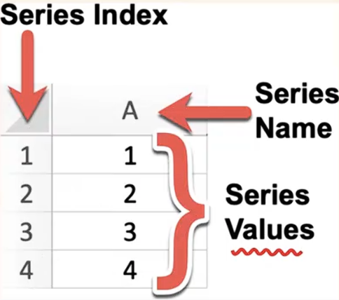
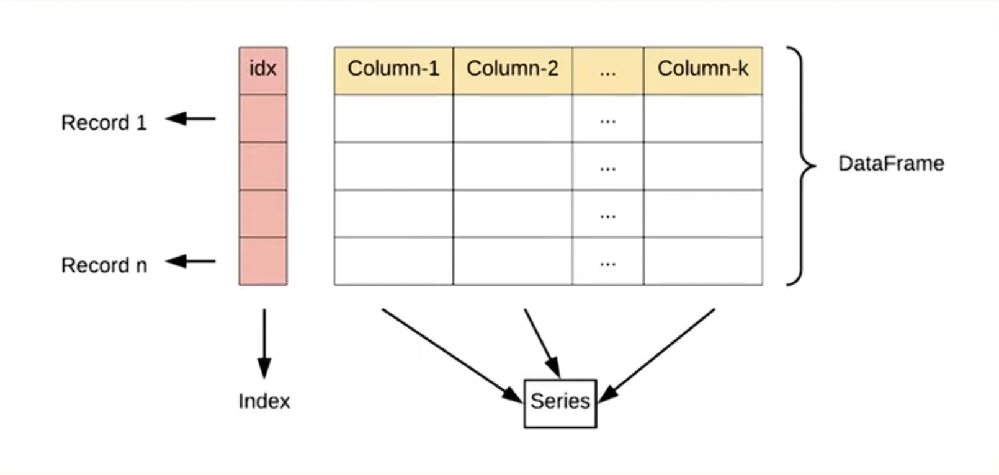

# 数据分析流程

数据收集→数据清洗→数据分析→数据可视化

## Jupyter快捷键

| 快捷键       | 功能                               |
| ------------ | ---------------------------------- |
| esc          | 从输入模式退出到命令模式           |
| a            | 在当前cell上面创建一个新的cell     |
| b            | 在当前cell下面创建一个新的cell     |
| dd           | 删除当前cell                       |
| m            | 切换到markdown模式                 |
| y            | 切换到code模式                     |
| ctrl+回车    | 运行cell                           |
| shift +回车  | 运行当前cell并创建一个新的cell     |

## Numpy科学计算

### 2.1 Numpy介绍

numpy是Python中科学计算的基础包。  
它是一个Python库，提供多维数组对象、各种派生对象（例如掩码数组和矩阵）以及用于对数组进行快速操作的各种方法，包括数学、逻辑、形状操作、排序、选择、I/O、离散傅里叶变换、基本 性代数、基本统计运算、随机模拟等等。  
numpy的部分功能如下：

- ndarray，一个具有矢量算术运算和复杂广播能力的快速且节省空间的多维数组。
- 用于对整组数据进行快速运算的标准数学函数（无需编写循环）。
- 用于读写磁盘数据的工具以及用于操作内存映射文件的工具具。
- 线性代数、随机数生成以及傅里叶变换功能。
- 用于集成由C、C++、Fortran等语言编写的代码的API。

### 2.2 ndarray

#### Numpy数组（ndarray）的核心特性：

- 多维性：支持0维（标量）、1维（向量）、2维（矩阵）及更高维数组  
- 同质性：所有元素类型必须一致（通过dtype指定）。
- 高效性：基于连续内存块存储。支持向量化运算。

- 多维性

```python
import numpy as np
arr = np.array(5) # 创建0维ndarry数组
print(arr)
print('arr的维度：', arr.ndim) # arr.ndim = number of dimensions arr
'''
5
arr的维度： 0
int64
'''
arr = np.array([1,2,3]) # 创建1维ndarry数组
print(arr)
print('arr的维度：', arr.ndim) # arr.ndim = arr.number of dimensions 
'''
[1 2 3]
arr的维度： 1
'''
arr = np.array([[1,2,3],[4,5,6]]) # 创建2维ndarry数组
print(arr)
print('arr的维度：', arr.ndim)
'''
[[1 2 3]
 [4 5 6]]
arr的维度： 2
'''
```

- 同质性

```python
import numpy as np
arr = np.array([1, 'error']) # 不同的数据类型会被强制转换成相同的数据类型
print(arr)
'''
['1' 'error']
'''
arr = np.array([1, 2.5]) # 整数浮点数同时被强制转换成相同的数据类型
print(arr) # 整数 1 转换为 1.
'''
[1.  2.5]
'''
```

#### ndarray的属性

| 属性名称 | 通俗解释                                     | 使用示例    |
| :------- | :------------------------------------------- | :---------- |
| shape    | 数组的形状：行数和列数（或更高维度的尺寸） | arr.shape   |
| ndim     | 维度数量：数组是几维的（1维、2维、3维等）  | arr.ndim    |
| size     | 总元素个数：数组中所有元素的总数           | arr.size    |
| dtype    | 元素类型：数组中元素的类型（整数、浮点数等）| arr.dtype   |
| ------- | ------------------------------------------- | ---------- |
| *T*      | 转置：行变列，列变行                         | arr.T       |
| *itemsize* | 单个元素占用的内存字节数                     | arr.itemsize|
| *nbytes* | 数组总内存占用量：size * itemsize            | arr.nbytes  |
| *flags*  | 内存存储方式：是否连续存储（高级优化）       | arr.flags   |

```python
arr = np.array([[1,2,3],[4,5,6]])
print(arr)
print('数组的形状：', arr.shape)
print('数组的维度', arr.ndim)
print('元素的个数：', arr.size)
print('元素的数据类型：', arr.dtype)
print('元素的转置：', arr.T, sep='\n')
'''
arr = np.array([[1,2,3],[4,5,6]])
print(arr)
print('数组的形状：', arr.shape)
print('数组的维度', arr.ndim)
print('元素的个数：', arr.size)
print('元素的数据类型：', arr.dtype)
print('元素的转置：', arr.T, sep='\n')
'''
```

#### ndarray的创建

1.基础构造：适用于手动构建小规模数组或复制已有数据。  
2.预定义形状填充：用于快速初始化固定形状的数组(如全0占位、全1初始化)。  
3.基于数值范围生成：生成数值序列，常用于模拟时间序列、坐标网格等。  
4.特殊矩阵生成：数学运算专用(如线性代数中的单位矩阵)。  
5.随机数组生成：模拟实验数据、初始化神经网络权重等场景。  
6.高级构造方法：理非结构化数据(如文件、字符串)或通过函数生成复杂数组。  

| 用途             | 方法                                       |
| :--------------- | :----------------------------------------- |
| 基础构造         | np.array()、np.copy()                      |
| 预定义形状填充   | np.zeros()、np.ones()、np.empty()、np.full() |
| 基于数值范围生成 | np.arange()、np.linspace()、np.logspace()   |
| 特殊矩阵生成     | np.eye()、np.diag()                        |
| 随机数组生成     | np.random.rand()、np.random.randn()、np.random.randint() |
| 高级构造方法     | np.array()、np.loadtxt()、np.fromfunction() |

#### 矩阵

| 名称 | 维度  | 示例                | 备注                 |
| ---- | ----- | ------------------- | -------------------- |
| 标量 | 0维   | 5, 3.14             | 单个数字，无行列     |
| 向量 | 1维   | [1, 2, 3]           | 只有行或列（一维数组）|
| 矩阵 | 2维   | [[1, 2], [3, 4]]    | 严格的行列结构（二维表）|
| 张量 | ≥3维  | [[[1, 2], [3, 4]]]  | 高阶数组（如RGB图像）|

#### ndarray的数据类型

| 数据类型       | 说明                                   |
| -------------- | -------------------------------------- |
| bool           | 布尔类型                               |
| int8、uint8    | 有符号、无符号的8位（1字节）整型       |
| int16、uint16  | 有符号、无符号的16位（2字节）整型      |
| int32、uint32  | 有符号、无符号的32位（4字节）整型      |
| int64、uint64  | 有符号、无符号的64位（8字节）整型      |
| float16        | 半精度浮点型                           |
| float32        | 单精度浮点型                           |
| float64        | 双精度浮点型                           |
| complex64      | 用两个32位浮点数表示的复数             |
| complex128     | 用两个64位浮点数表示的复数             |

#### 索引与切片

| 索引/切片类型 | 描述/用法                                   |
| ------------ | ------------------------------------------ |
| 基本索引     | 通过整数索引直接访问元素。索引从0开始     |
| 行/列切片    | 使用冒号：切片语法选择行或列的子集        |
| 连续切片     | 从起始索引到结束索引按步长切片            |
| 使用 slice 函数 | 通过 slice(start, stop, step) 定义切片规则 |
| 布尔索引     | 通过布尔条件筛选满足条件的元素。支持逻辑运算符 &、\| |

### 2.3 Numpy常用函数

| 基本数学                | 统计                  | 比较与条件                     | 去重与匹配          | 其他操作                  | 排序相关              |
|-------------------------|-----------------------|--------------------------------|---------------------|---------------------------|-----------------------|
| np.sqrt(x)              | np.sum(x)             | np.greater(a, b)               | np.unique(x)        | np.concatenate((a, b))    | np.sort(x)            |
| np.exp(x)               | np.mean(x)            | np.less(a, b)                  | np.in1d(a, b)       | np.split(x, indices)      | x.sort()              |
| np.log(x)               | np.median(x)          | np.equal(a, b)                 |                     | np.reshape(x, shape)      | np.argsort(x)         |
| np.sin(x)               | np.std(x)             | np.logical_and(a, b)           |                     | np.copy(x)                | np.lexsort(keys)      |
| np.abs(x)               | np.var(x)             | np.where(condition, x, y)      |                     | np.isnan(x)               |                       |
| np.power(a, b)          | np.min(x) / np.max(x) |                                |                     |                           |                       |
| np.round(x, n)          | np.percentile(x, q)   |                                |                     |                           |                       |

### 3.1 Pandas 介绍
Pandas是Python数据分析工具链中最核心的库,充当数据读取、清洗、分析、统计、输出的高效工具。  
Pandas提供了易于使用的数据结构和数据分析工具,特别适用于处理结构化数据,如表格型数据(类似于Excel表格)。  
Pandas是数据科学和分析领域中常用的工具之一,它使得用户能够轻松地从各种数据源中导入数据,并对数据进行高效的操作和分析。  

**Pandas核心设计理念**  
Pandas是基于NumPy构建的专门为处理表格和混杂数据设计的Python库,核心设计理念包括：
- 标签化数据结构：提供带标签的轴
- 灵活处理缺失数据：内置NaN处理机制
- 智能数据对齐：自动按标签对齐数据
- 强大IO工具：支持从CSV、Excel、SQL等20+数据源读写
- 时间序列处理：原生支持日期时间处理和频率转换

**Pandas特性**  

| 特性     | Series                | DataFrame                  |
|----------|-----------------------|----------------------------|
| 维度     | 一维                  | 二维                       |
| 索引     | 单索引                | 行索引+列名                |
| 数据存储 | 同质化数据类型        | 各列可不同数据类型         |
| 类比     | Excel单列             | 整张Excel工作表            |
| 创建方式 | pd.Series([1,2,3])    | pd.DataFrame({'col':[1,2,3]}) |

### 3.2 Series



**Series的属性**  

| 属性         | 说明               | 属性    | 说明                     |
| ------------ | ------------------ | ------- | ------------------------ |
| index        | Series的索引对象   | loc[]   | 显式索引，按标签索引或切片 |
| values       | Series的值         | iloc[]  | 隐式索引，按位置索引或切片 |
| dtype或dtypes | Series的元素类型   | at[]    | 使用标签访问单个元素     |
| shape        | Series的形状       | iat[]   | 使用位置访问单个元素     |
| ndim         | Series的维度       |         |                          |
| size         | Series的元素个数   |         |                          |
| name         | Series的名称       |         |                          |

**Series的常用方法**  

| 方法         | 说明                                       | 方法         | 说明                                               |
| ------------ | ------------------------------------------ | ------------ | -------------------------------------------------- |
| head()       | 查看前 n 行数据，默认 5 行                 | max()        | 最大值                                             |
| tail()       | 查看后 n 行数据，默认 5 行                 | var()        | 方差                                               |
| isin()       | 判断元素是否包含在参数集合中               | std()        | 标准差                                             |
| isna()       | 判断是否为缺失值（如 NaN 或 None）         | median()     | 中位数                                             |
| sum()        | 求和，自动忽略缺失值                       | mode()       | 众数（可返回多个）                                 |
| mean()       | 平均值                                     | quantile(q)  | 分位数，q 取 0~1 之间                              |
| min()        | 最小值                                     | describe()   | 常见统计信息（count、mean、std、min、25%、50%、75%、max） |
| value_counts()    | 每个唯一值的出现次数     | sort_values()| 按值排序                                           |
| count()           | 非缺失值数量             | replace()    | 替换值                                             |
| nunique()         | 唯一值个数（去重）| keys()       | 返回 Series 的索引对象                             |
| unique()          | 获取去重后的值数组       |              |                                                    |
| drop_duplicates() | 去除重复项               |              |                                                    |
| sample()          | 随机抽样                 |              |                                                    |
| sort_index()      | 按索引排序               |              |          

### 3.3 DataFrame




**DataFrame的创建方式**  

```python
# dataframe的创建方式
import pandas as pd
import numpy as np

# 通过series创建
s1 = pd.Series([1,2,3,4,5])
s2 = pd.Series([6,7,8,9,10])
df = pd.DataFrame({'第一列':s1, '第二列':s2})
print(df)
print(type(df))
print(type(df['第一列']))

# 通过字典创建
df = pd.DataFrame(
    {
        'id':[1,2,3,4,5],
        'name':['tom', 'jack', 'alice', 'bob', 'allen'],
        'age':[15,17,20,18,19],
        'score':[60.5,80,75,95,100]
    },index=[1,2,3,4,5],columns=['name', 'score', 'age'] # 隐藏id
)
print(df)
```

**DataFrame的属性**  

| 属性    | 说明                 | 属性    | 说明                               |
|---------|----------------------|---------|------------------------------------|
| index   | DataFrame的行索引    | loc[]   | 显式索引，按行列标签索引或切片     |
| values  | DataFrame的值        | iloc[]  | 隐式索引，按行列位置索引或切片     |
| dtypes  | DataFrame的元素类型  | at[]    | 使用行列标签访问单个元素           |
| shape   | DataFrame的形状      | iat[]   | 使用行列位置访问单个元素           |
| ndim    | DataFrame的维度      | T       | 行列转置                           |
| size    | DataFrame的元素个数  |         |                                    |
| columns | DataFrame的列标签    |         |                                    |

**DataFrame常用方法**  

| 方法       | 说明                               | 方法         | 说明                                       |
|------------|------------------------------------|--------------|--------------------------------------------|
| head()     | 查看前 n 行数据，默认 5 行         | max()        | 最大值                                     |
| tail()     | 查看后 n 行数据，默认 5 行         | var()        | 方差                                       |
| isin()     | 判断元素是否包含在参数集合中       | std()        | 标准差                                     |
| isna()     | 判断是否为缺失值（如 NaN 或 None） | median()     | 中位数                                     |
| sum()      | 求和，自动忽略缺失值               | mode()       | 众数（可返回多个）                         |
| mean()     | 平均值                             | quantile(q)  | 分位数，q 取 0~1 之间                      |
| min()      | 最小值                             | describe()   | 常见统计信息（count、mean、std、min、25%、50%、75%、max） |

